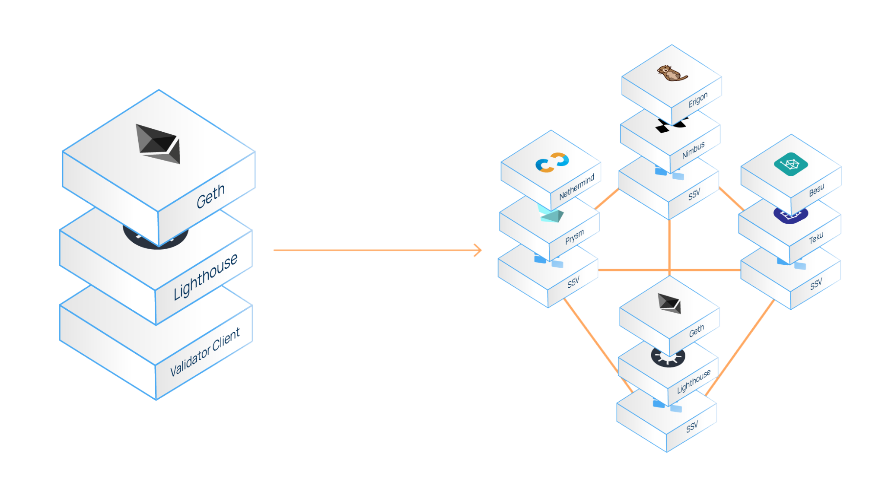
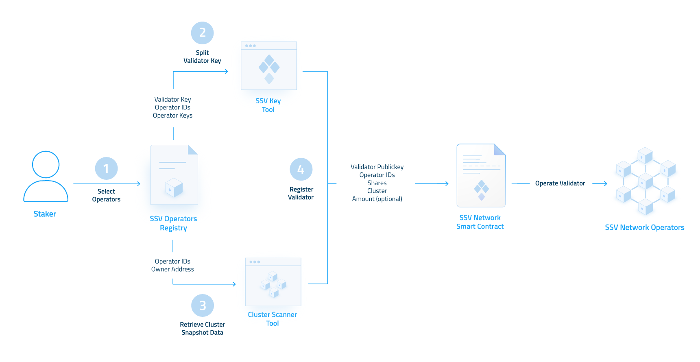
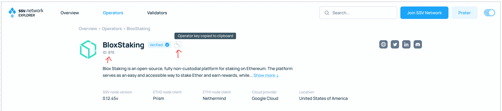

# Get Started

The SSV network enables the distribution of validator operations between non-trusting operators.

<figure><figcaption></figcaption></figure>


In order to distribute your validator, you must have an activated (deposited) validator on the Beacon Chain.


## How to Run a Distributed Validator 

This guide outlines the steps required to run a distributed validator via the ssv.network on the _**Holesky testnet**_, using the protocol’s smart contracts and developer tools.

### Prerequisites 

* **An Ethereum validator** - to generate validator keys and activate them using Ethereum’s official [Staking Deposit CLI](https://github.com/ethereum/staking-deposit-cli) and [Launchpad](https://goerli.launchpad.ethereum.org/), please [follow this guide](../validator-user-guides/validator-management/creating-a-new-validator.md). You can also run a Distributed Key Generation ceremony using [SSV DKG Client](tools/ssv-dkg-client/generate-key-shares.md)
* **Holesky ETH** (<0.1) to cover transaction gas costs on the Holesky testnet (Community members on our [discord](https://discord.gg/ssvnetworkofficial) could assist in obtaining the required amount).
* **Testnet SSV** ([faucet](https://faucet.ssv.network/))

### Process Overview 

Validators are managed within Clusters - the group of operators that were selected to operate them.

Running a distributed validator is outlined by the following steps:

1. Select the cluster of operators to manage your validator.
2. Split your validator key to shares.
3. Retrieve your cluster’s latest snapshot data.
4. Register your validator to the network.

<figure><figcaption>
<em>Process Diagram</em>
</figcaption></figure>

#### 1. Operator Selection 

Select your preferred group of operators from the operator registry of the SSV network.

The number of cluster operators you select must be **3f+1** compatible, whereas **f** is the number of faulty operators that your cluster could endure (more operators, greater fault tolerance) - e.g. 4, 7, 10, 13…

For each chosen operator, you must fetch its network assigned **id** and its corresponding **key**.

<figure><figcaption></figcaption></figure>

#### 2. Split Validator Key to Shares 

To assign the validator operation to the cluster of your selected operators, you must split your validator key to shares.

Use the [SSV Keys](tools/ssv-keys-distributor.md) tools to extract your validator key from your keystore file and split it to shares.


This can also be with multiple keys to register validators in bulk.


#### 3. Retrieve Cluster Snapshot Data 

Cluster snapshots are required for SSV smart contract transactions with cluster related functions which require the **cluster object** as input.

Cluster snapshots are updated after each transaction with a cluster related function, and will emit a new **cluster object** (the latest snapshot) which will be required for making the succeeding transaction.

Use the [ SSV Scanner](tools/cluster-scanner.md) tool to retrieve the latest snapshot data for your validator’s cluster.


If this is the first validator within a cluster, you can skip this step and use **{0,0,0,0,true}** for the **cluster object**.


#### 4. Network Registration 

To signal your cluster to start operating your validator, you must register your validator to the network by broadcasting the [registerValidator()](https://docs.ssv.network/developers/smart-contracts/ssvnetwork#registervalidator-publickey-operatorids-shares-amount-cluster) transaction to the ssv.network contract:


You can perform this in bulk for multiple validators using [bulkRegisterValidator](https://docs.ssv.network/developers/smart-contracts/ssvnetwork#bulkregistervalidator-publickey-operatorids-shares-amount-cluster).


<table><thead><tr><th width="136.33333333333331">Parameter</th><th width="95">Type</th><th>Description</th></tr></thead><tbody><tr><td>publicKey</td><td>bytes</td><td>The validator’s public key.</td></tr><tr><td>operatorIds</td><td>uint64[]</td><td>List of all operator’s ids which were selected during the “Operators Selection” step (ascending order).</td></tr><tr><td>sharesData</td><td>bytes[]</td><td>Keyshares which were produced during the “Key Splitting” step.</td></tr><tr><td>amount</td><td>uint256</td><td>Amount of SSV tokens to be deposited as payment (not mandatory). See <a href="../learn/stakers/validators/validator-onboarding.md#_kumpogh364aq">validator funding</a> to calculate how much funding is needed to run each validator.  <em><strong>Amount must be shrinkable (divisible by 10000000)</strong></em></td></tr><tr><td>cluster</td><td>tuple[]</td><td>
Object containing the latest cluster snapshot data, produced during the “Retrieve Cluster Snapshot” step - obtained using the <a href="tools/ssv-subgraph/">SSV Subgraph</a>, or the <a href="tools/cluster-scanner.md">SSV Scanner</a> tool.

<strong>If this is the 1st validator within a specific cluster (unique set of operators), use - {0,0,0,true,0}</strong>
</td></tr></tbody></table>

You can construct the transaction by yourself or through using the partial payload generated by the [SSV Keys](tools/ssv-keys-distributor.md) tool used in the “Key Splitting” step.


Please note that as SSV is deposited to the contract, you must initially approve the SSV contract address to spend your SSV tokens prior to the registration transaction.

