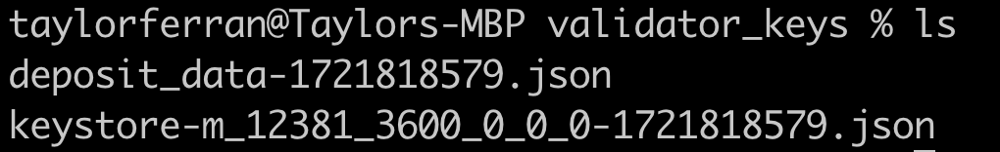

# Lido CSM

Lido's Community Staking Module lets community stakers utilize the Lido protocol to run validators in a permissionless manner. We can combine this with the SSV network to incorporate DVT into CSM.

In this guide we'll run through how to create validator keys, register them on the SSV network with SSV network operators, and post the bond through CSM to activate the validator.


Currently, CSM is only available on Holesky, so this guide follows that flow. Once it is released on Mainnet this guide will be updated with the correct contract addresses.


### Key conditions for validators registered to CSM

Lido requires a bond, but will deposit and activate the validator, so for this reason:

* **you must** **set the withdrawal address to** [**the Lido Withdrawal vault**](https://holesky.etherscan.io/address/0xF0179dEC45a37423EAD4FaD5fCb136197872EAd9).
* **you must** **set the fee recipient address to** [**Lido Execution Layer Rewards Vault**](https://holesky.etherscan.io/address/0xE73a3602b99f1f913e72F8bdcBC235e206794Ac8).

These two conditions are necessary and cannot be omitted.


Changing the fee recipient on SSV applies to **all validators owned by an account**. So if you have registered CSM validators in the past, or intend to register validators that will not be part of CSM in the future, please utilize a different account, or you will be effectively **donating the execution rewards to Lido** instead of keeping them for yourself.


### Prerequisites&#x20;

* Over 2 Holesky ETH for CSM bonding and gas for transactions.
* SSV tokens when registering your validator to the network: [**SSV faucet**](https://faucet.ssv.network/)
* A new account/wallet which does not have any validators registered with SSV already, as we need to set the fee recipient to Lido's address.

### 1. Creating validator keys

Validator keys for the CSM module can be created the same way as any other validator key, with one difference mentioned above: **you must** **set the withdrawal address to** [**the Lido Withdrawal vault**](https://holesky.etherscan.io/address/0xF0179dEC45a37423EAD4FaD5fCb136197872EAd9).

So for this step, you can simply follow the [guide on generating validator keys found here](../../validator-user-guides/validator-management/creating-a-new-validator.md#generate-validator-keys), just know that when generating the keys, the withdrawal address needs to be set to this value (for Holesky):

```
0xF0179dEC45a37423EAD4FaD5fCb136197872EAd9
```

Please note that it is only necessary to generate the keys and not activate them, so just follow the procedure until both the deposit and keystore json files have been generated and saved on your machine:

<figure><figcaption></figcaption></figure>


Make sure to take note of the keystore password you used to generate these keys.


### 2. Register the validator with SSV

To register your validator with SSV you can follow [the related guide in this documentation](../../validator-user-guides/validator-management/distributing-a-validator.md). All of the steps you need to follow are exactly the same as the ones for a CSM validator. Make sure to have your keystore file and password ready.

You can move onto the next step once your validator is registered to a cluster as shown below.

<figure><figcaption></figcaption></figure>

### 3. Set the Fee Recipient&#x20;

As mentioned at the top of this guide, a requirement from Lido for all the validators registered to the CSM is that the fee recipient is set to the Lido Execution Layer Rewards Vault.

As mentioned at the top of the page, this operation is account-wide, so if you don't want other "non-CSM" validators to be impacted, stop this procedure and use a different account.

Once the cluster is in place it's the perfect time to set the fee recipient. On the webapp, browse to the clusters management tab, and in the top right you will see the option to set Fee Address.

<figure><figcaption></figcaption></figure>

In the following screen, set the address to this value:

```
0xE73a3602b99f1f913e72F8bdcBC235e206794Ac8
```

Enter the address, click update, and sign the transaction with your wallet.

<figure><figcaption></figcaption></figure>

### 4. Deposit bond on Lido CSM&#x20;

The following, and final step is to deposit the 2 ETH bond to Lido along with the validator deposit data to add the validator to the activation queue. Lido will deposit the 32 ETH needed for the activation to happen.

Browse to [https://csm.testnet.fi/keys/submit](https://csm.testnet.fi/keys/submit) and connect your wallet.

At this point, you'll need the `deposit.json` file [generated during the first step of this guide](lido-csm.md#id-1.-creating-validator-keys).

Open the file, copy its content to your clipboard, and paste it into the "Upload deposit data" textbox as shown below.

<figure><figcaption></figcaption></figure>

Then click submit and sign the transaction to deposit 2 ETH.

<figure><figcaption></figcaption></figure>

Once the transaction has gone through, you can go to the "View Keys" section of the CSM website to confirm your transaction has succeeded.

<figure><figcaption></figcaption></figure>

This concludes the procedure, now you just need to wait for your validator to be activated, this may take a while depending on how big the queue is.

#### Validator activation queue

To check your validator you can use this link, making sure to swap `<YOUR_VALIDATOR_PUBLIC_KEY_HERE>` with the actual public key of the validator you want to monitor.:

```
https://holesky.beaconcha.in/validator/<YOUR_VALIDATOR_PUBLIC_KEY_HERE>
```

Once the validator has been activated, the SSV operators you have chosen in step two will handle the validator duties for you.&#x20;
