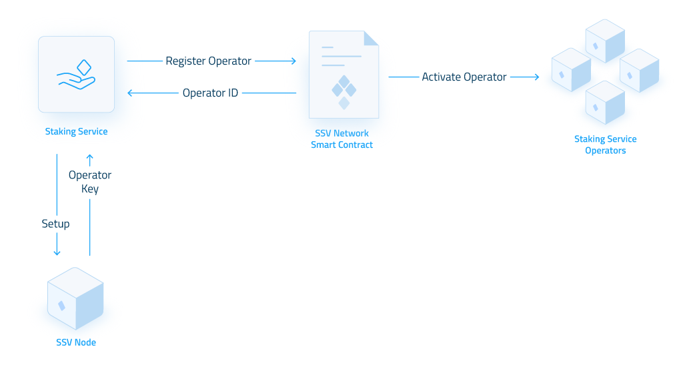
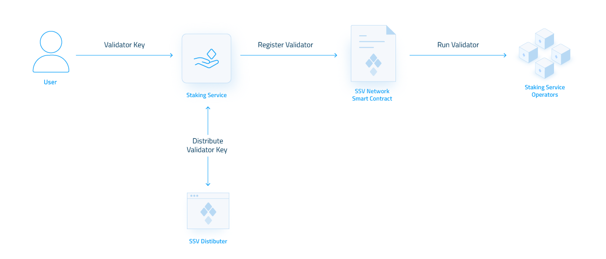

# Staking Services


This section and the documents under it have not been updated to V3 testnet


Staking service providers ("[SaaS](https://ethereum.org/en/staking/saas/)") allow users to stake ETH without needing technical knowledge about complex validator node setups. By taking care of node operation, staking services reduce the technical barrier for Ethereum staking while also presenting new risks, the biggest among them centralization and single points of failure.

In today's service ecosystem, most providers hold multiple sets of validator nodes, each with different technological stacks (EL/CL nodes, hardware, geolocation, etc.) Providers do this to diversify their services and mitigate the risk of single points of failure. However, this setup also faces the challenge of centralization by managing many validators over multiple validator nodes.

In contrast to these approaches, running an SSV-based infrastructure inherently provides diversification and distribution without the constant need for balancing validator nodes. By splitting validator keys between operators, there is no single point of failure, and by using consensus-based duty validators, SSV enables true active-active fault tolerance, eliminating potential slashing risks and centralization.

### Integration Overview

This integration guide outlines running and maintaining a staking service using Distributor Validator Technology (DVT) via the ssv.network.

Running an SSV-based staking service is outlined by these 3 stages:

* [Operator nodes setup](staking-services.md#operator-node-setup) - initial setup of SSV operator nodes required to run distributed validators.
* [Validator onboarding](staking-services.md#validator-onboarding) - distributing and registering validators managed by the staking service to the ssv.network.
* [Account management](staking-services.md#account-management) - ongoing administration of the staking service account, validators, and operators.

### Operator Node Setup

The first stage is responsible for the initial setup of the staking service's SSV operator nodes.

Since a group of operators manages every validator, you must run 4 operator nodes to manage your serviced validators. Your service can reduce the number of nodes needed by selecting any other network operators alongside your own.

Please note that you can always customize your validators’ operator group and reassign them to different operators in the future.

In order to set up your nodes and register your operators to the network, follow these steps for each operator:

1. [Install operator node](../../run-a-node/operator-node/installation.md)
2. [Register operator](../../run-a-node/operator-node/registration.md)
3. [Monitor node via Grafana ](broken-reference)(OPTIONAL but recommended)

### Validator Onboarding

The second stage outlines how to onboard new or existing validators that your operator group will manage.

In order to assign validator operations to your operators, you must distribute their validator key to KeyShares and register them to the ssv.network.

Follow the [Run a Distributor Validator](../get-started.md) guide for each new validator you want to manage.

Please note that since validators are assigned to the staking service’s Operators (created during the previous stage), the “Operators Selection” step can be skipped.

#### Validator Funding

Your staking service account must be funded with the appropriate amount of SSV to carry your validator's operational costs. These costs come in the form of operator and network fees (learn more on account balance and validator funding).

Keep in mind that all the validators that you manage will pay operator fees back to your own operators (basically paying yourself). Therefore, you don’t need to account for operator fees when calculating the required funding for running each of the validators you manage.

To calculate the required funding disregarding your own operators fees, use:

$$
Required\,Funding =( O1fee+O2_{fee}+ O3_{fee} + O4_{fee}+N_{fee})*LTP  + (N_{fee} *Period )
$$

Legend:

* $$O1...4_{fee}$$ - operator fee ($SSV per block)
* $$N_{fee}$$ - [network fee](../../learn/protocol-overview/tokenomics/fees.md#\_k4tw9to38r3v) ($SSV per block)​
* $$Period$$ - operation period (blocks)
* $$LTP$$ - [liquidation threshold period](../../learn/protocol-overview/tokenomics/liquidations.md#liquidation-risk)

### Account Management

The third stage outlines how to manage the staking service account, operators, and managed validators.

All management capabilities are accessible via our [webapp](https://app.ssv.network) to the staking service account, or on-chain - by interacting with our [smart contracts](../smart-contracts/).

#### Balance Management

The staking service account balance on the ssv.network needs to be kept in check to ensure the continued operation of its managed validators.

To manage account balance, the staking service can deposit or withdraw funds from it.

* [Deposit](../smart-contracts/ssvnetwork.md#public-deposit-owner-operatorids-amount-cluster)
* [Withdraw](../smart-contracts/ssvnetwork.md#public-withdraw-operatorids-amount-cluster)

#### Validator Management&#x20;

Validators are fully customizable in the ssv.network, giving service providers more flexibility and control over their operations. Having the ability to update the operator group managing your validators can be useful when you want to spin up an additional operator or use another operator’s services. Additionally, being able to offboard a validator can help if one of your users wants to stop their validator operation or migrate to a different service.

* [Update operators](../../learn/stakers/validators/update-operators.md)
* [Remove validator](../../learn/operators/offboarding.md)

#### Operator Management

Because staking service operators are discoverable by all network participants, other stakers could select the staking service as one of their operators. Your staking service can also always adjust the fees charged by its operators according to market dynamics and competitiveness.

* [Update operator fee](../../learn/operators/update-fee.md)
