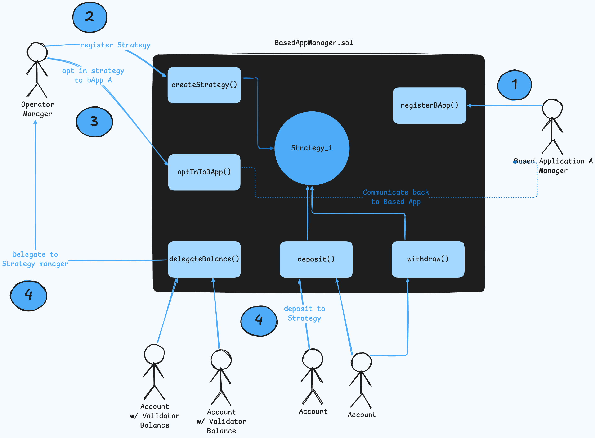
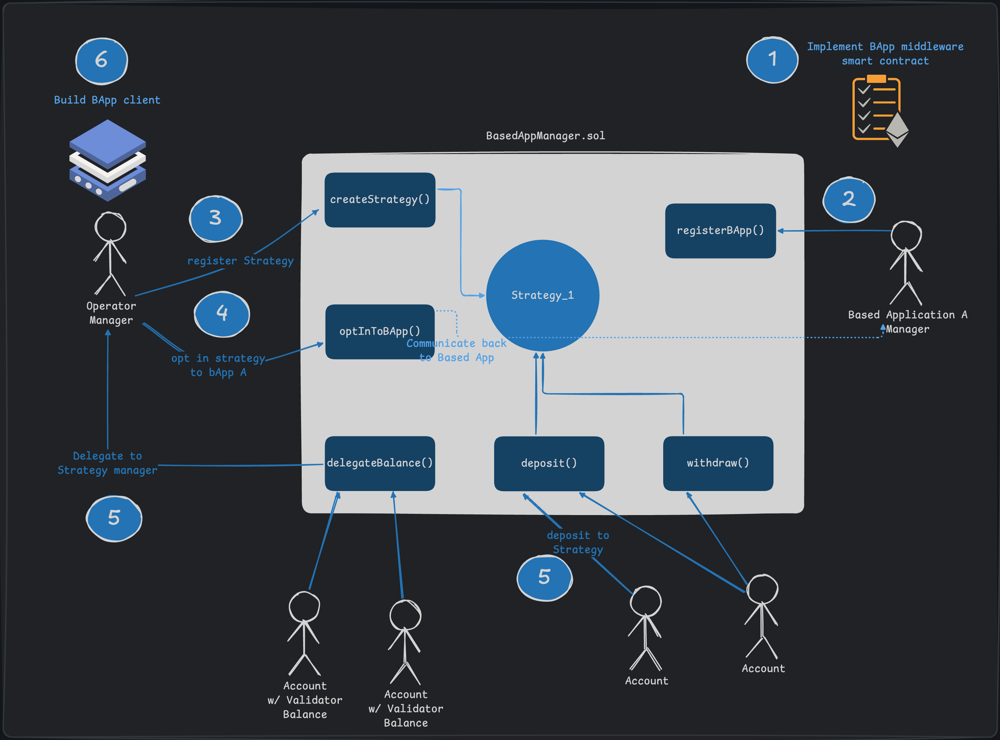

---
sidebar_label: 'Get Started'
sidebar_position: 1
--- 

# Get Started

## Developing a Based Application

This guide outlines the steps for based applications developers looking to build on the Based Applications platform. Below is a diagram that summarizes the full Based Applications development flow.

1. Implement Based Application middleware contract
2. Create and Register the bApp
3. Strategies creation
4. Strategies opt-in to the bApp
5. Strategies secured by token deposits or validator balance delegation
6. Build BApp client for strategies to operate


This will walk through the process of what is needed to register and run a Based Application. To develop a bApp, you will need to develop a client which participants (represented as strategies) will run. This client will be responsible for listening for tasks to take on, and submitting the result of the task once it is completed.

<!-- <div className="theme-code-block">
  
  
</div> -->

## 1. Developing a Based Application Middleware smart contract

The `BAppManager` smart contract developed by SSV Labs accepts registrations of BApps that implement a specific interface. This is outlined [in this dedicated page](./smart-contracts/based-app-interface.md), that also provides a simple example.

## 2. Configuring and Registering the bApp

1. **Define core attributes**:
- `bApp`: a unique 20-byte EVM address that uniquely identifies the bApp.
- `tokens`:  A list of ERC-20 tokens to be used in the bApp's security mechanism. For the native ETH token, use the special address [`0xEeeeeEeeeEeEeeEeEeEeeEEEeeeeEeeeeeeeEEeE`](https://github.com/ssvlabs/based-applications/blob/main/src/SSVBasedApps.sol#L74).
- `sharedRiskLevels`: a list with $\beta$ values, one for each token, representing the bApp's tolerance for risk (token over-usage).
2. **Optional Non-Slashable Validator Balance**: If the bApp uses non-slashable validator balance, it should be configured off-chain, in the bApp's network.
3. **Register the bApp**: Use the [`registerBApp`](./smart-contracts/SSVBasedApps#registerbappbapp-tokens-sharedrisklevels-metadatauri) function of the smart contract:
```javascript
function registerBApp(
   address bApp,
   address[] calldata tokens,
   uint32[] calldata sharedRiskLevels,
   string calldata metadataURI
)
```
- `metadataURI`: A JSON object containing additional details about your bApp, such as its name, description, logo, and website.
4. **Update Configuration**: After registering, the bApp configuration can be updated only by the `owner` account.

## 3. Strategies creation

Node managers can register a Strategy at any point in time, and in some way this is independent of the BApp itself. So the cardinal order in this step is only representative of the requirement for the BApp.

Strategies can be registered by using the [`createStrategy`](./smart-contracts/SSVBasedApps#createstrategyfee-metadatauri) function of the smart contract:

```javascript
function createStrategy(
   uint256 fee,
   string calldata metadataURI
)
```
- `fee`: The fee to be paid to the operator for participating in the bApp.
- `metadataURI`: A JSON object containing additional details about the strategy, such as its name, description, logo, and website.

## 4. Opting in

A Strategy opts-in to the bApp by using the [`optInToBApp`](./smart-contracts/SSVBasedApps#optintobappstrategyid-bapp-tokens-obligationpercentages-data) function of the smart contract:

```javascript
function optInToBApp(
   uint256 strategyId,
   address bApp,
   address[] calldata tokens,
   uint32[] calldata obligationPercentages,
   bytes calldata data
)
```
- `tokens`: List of tokens to obligate to the bApp.
- `obligationPercentages`: The proportion of each token's balance to commit to the bApp.
- `data`: An extra optional field for off-chain information required by the bApp for participation.

For example, if `tokens = [SSV]` and `obligationPercentages = [50%]`, then 50% of the strategy's `SSV` balance will be obligated to the bApp.

The strategy’s owner can later update their obligations by modifying existing ones or adding a new token obligation.

## 5. Strategy's Funds

To compose their balances, strategies:
1. receive ERC20 (or ETH) via [**deposits**](https://github.com/ssvlabs/based-applications/blob/main/src/SSVBasedApps.sol#305) from accounts.
2. inherit the non-slashable validator balance from the strategy's owner account. Accounts [**delegate**](https://github.com/ssvlabs/based-applications/blob/main/src/SSVBasedApps.sol#188) validator balances between themselves, and the strategy inherits its owner's non-delegated balance plus the received balances from other accounts.

## 6. Build BApp client

Operators will run a client which is specific to the bApp they have opted into. Different Based Applications may have different needs, and as such, the actual implementations vary a lot: the triggers for BApp-specific logic execution can be based on blockchain events, they could be based on scheduling, or other off-chain conditions.

One thing the BApp clients should have in common is that they should calculate the **strategy weights** derived from the balance (tokens and validator balances) allocated to the strategy, as well as the associated **risk** for these balances and use these as voting power. The innovation represented by SSV's Based Applications, is that when a client has completed its execution, it will use the strategy weight to "vote" for its own result, and this will represent the risk-adjusted value of the sum of slashable and non-slashable capital attached to the strategy itself.

The BApp SDK provides high level functions to do this, facilitating the process. For an in-depth look at how all of this works, [please have a look at the dedicated example page](./bapp-example.md). This shows two separate strategies completing a simple task (provide the next Ethereum block number) independently, then voting on the result, and ensuring a consensus (majority vote) is reached.

### Example


Example client flow:


Example pseudocode:

``` typescript
import { ethers } from 'ethers';

// Represents a client that participates in a voting system by fetching block numbers and broadcasting votes
class BasedClient {
  constructor(id, rpcUrl, network) {
    this.id = id; // strategy id ?
    this.provider = new ethers.providers.JsonRpcProvider(rpcUrl);
    this.network = network; 
    this.votes = []; // Stores received votes
  }

  // 1. Fetch block number
  // Fetches the latest block number from the Ethereum network
  async fetchSlot() {
    console.log(`🔍 Fetching latest slot...`);
    const slotNumber = await this.provider.getBlockNumber();
    console.log(`✅ Latest slot: ${slotNumber}`);
    return slotNumber;
  }

// Generates a random weight based on the strategy ID
// TODO: Replace with SDK weight calculation
calculateWeight() {
  const hash = [...this.id].reduce((acc, char) => acc + char.charCodeAt(0), 0);
  return (hash % 50) + 1; // Generates a weight between 1 and 50
}

=// Signs (simply assigns) and broadcasts the vote to the network
signAndBroadcastTask(slot) {
  console.log(`✍️ Broadcasting vote...`);
  const weight = this.calculateWeight(); // Generate participant weight
  const signedVote = { participantID: this.id, slot, weight }; // Creates a vote object with weight
  console.log(`📤 Broadcasting vote:`, signedVote);
  this.network.broadcast(signedVote); // Sends vote to network
}

// Processes a received vote from another participant
processVote(signedVote) {
  console.log(`📥 Processing received vote from ${signedVote.participantID}`);
  this.votes.push(signedVote); // Stores the received vote
}

// Checks if a majority vote has been reached for a particular block slot
checkMajority() {
  console.log(`🔎 Checking majority vote...`);
  const voteCounts = {}; // Dictionary to count weighted votes per slot
  this.votes.forEach(({ slot, weight }) => {
    voteCounts[slot] = (voteCounts[slot] || 0) + weight;
  });
  
  const threshold = 50; // Minimum weighted votes needed for a majority
  for (const slot in voteCounts) {
    if (voteCounts[slot] > threshold) {
      console.log(`🏆 Majority reached for slot ${slot} with weight ${voteCounts[slot]}`);
      return Number(slot);
    }
  }
  console.log(`❌ No majority reached yet.`);
  return null;
}

// Runs the client in a loop, checking for tasks to complete
async run() {
  console.log(`🔄 Waiting for tasks...`);
  while (true) {
    const hasTask = await this.checkForTask(); // Simulating event trigger
    if (hasTask) {
      console.log(`🚀 Task detected, fetching slot...`);
      const slotNumber = await this.fetchSlot(); // Fetch latest slot number
      this.signAndBroadcastTask(slotNumber); // Sign and broadcast the vote
    }
    await new Promise(resolve => setTimeout(resolve, 5000)); // Wait 5 seconds before checking again
  }
}

  // Simulated function to check for an event from the contract
  async checkForTask() {
    // Here, we would listen for an event emitted from the contract
    // For now, simulate with a random boolean
    return Math.random() > 0.5;
  }
}
```


