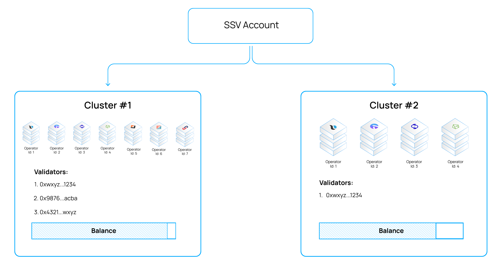

# Clusters

Distributed validators are managed within Clusters - the group of operators that were selected to operate them.\
Clusters are unique to each account and are used for fees payment facilitation and management purposes.

<figure><figcaption>
Example of an account with 2 clusters:  Cluster #1 manages 3 validators and is operated by operators 1,2,3,4,5,6,7  Cluster #2 manages 1 validator and is operated by operators 1,2,3,4
</figcaption></figure>
