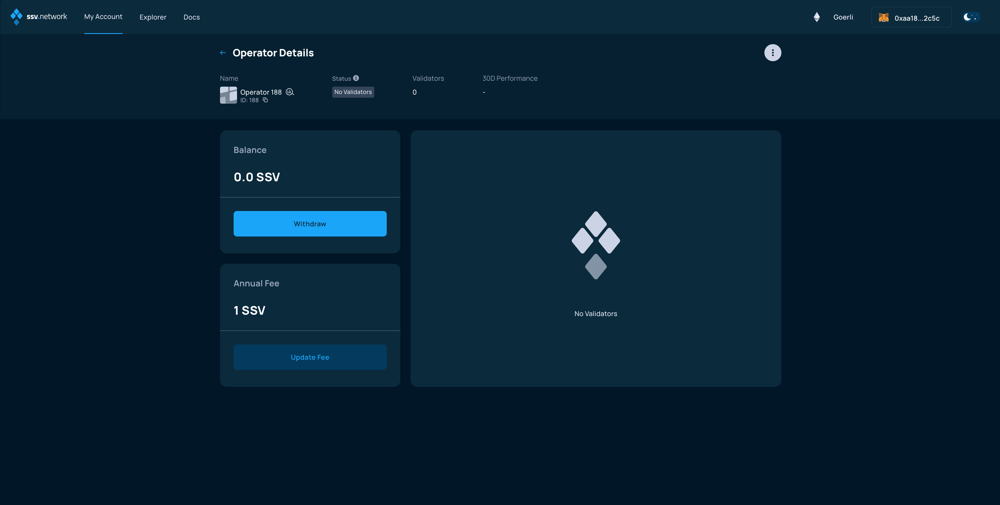
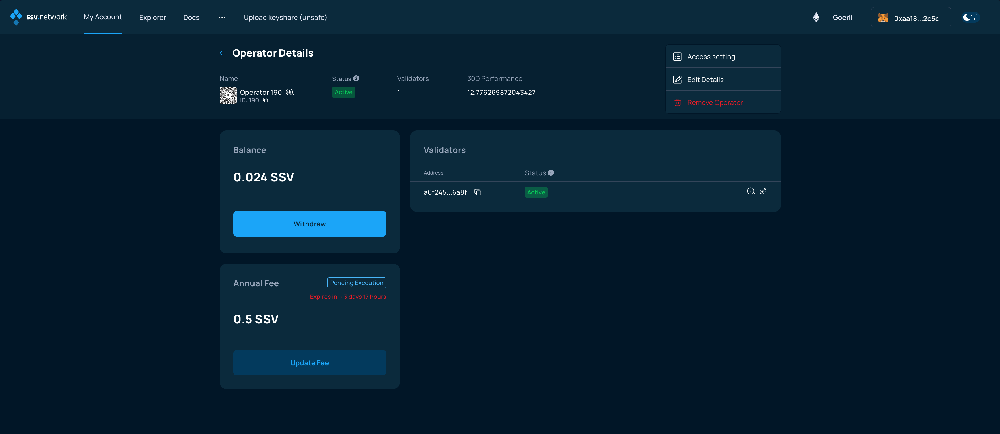
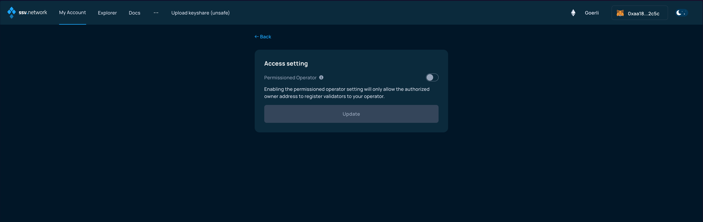
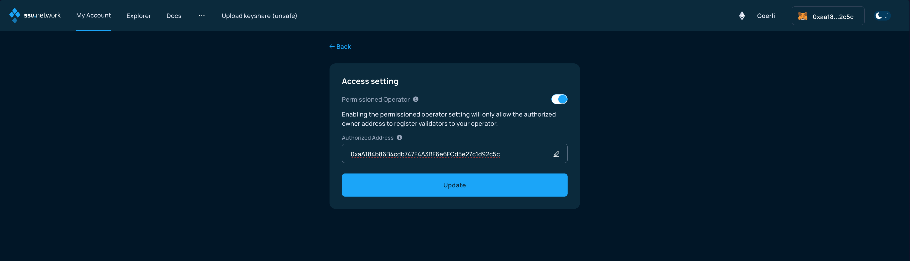
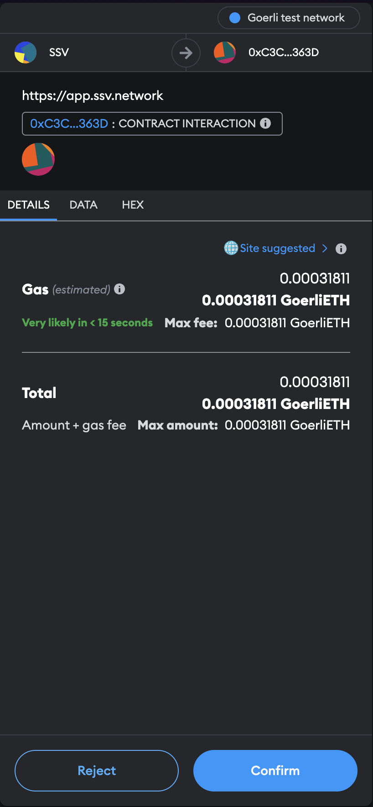
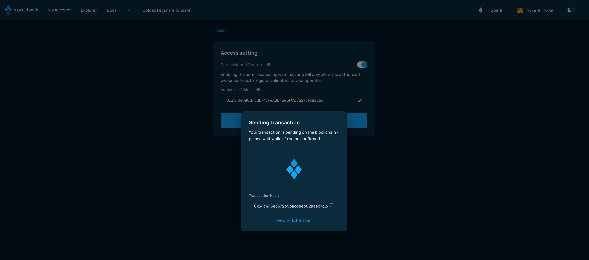
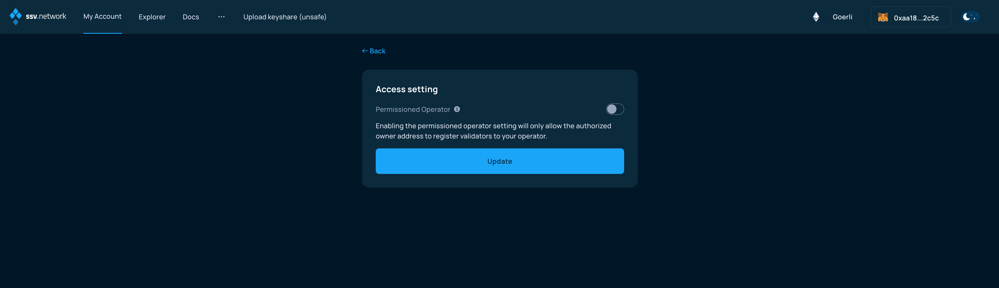
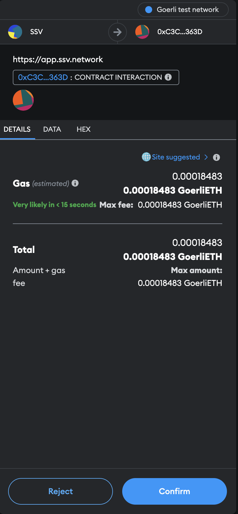

# Configuring a permissioned Operator

### Connect your Web3 wallet to WebApp

Make sure to connect your Web3 wallet with the WebApp, and that the address corresponds with the one you want to manage your Operators with.


**Note:** Your account is associated with your Web3 wallet.


### Enabling Permissioned Operator setting

Once connected, browse to the _My Account_ page and select the Operator you want to update from the _Operator Dashboard_.

<figure><figcaption></figcaption></figure>

Then, on the _Operator Details_ screen, click on the three vertical dots on the top-right corner.

<figure><figcaption></figcaption></figure>

From the dropdown, choose the _Access Settings_ option.

<figure><figcaption></figcaption></figure>

In the following screen, you will need to enable the permissioned operator setting, by switching the toggle button on the right.

<figure><figcaption></figcaption></figure>

When enabled, it will allow you to enter a wallet address. This address is going to be _whitelisted_ to be the only address able to [register Validators](../../validator-user-guides/validator-management/distributing-a-validator.md) to this Operator.

<figure><figcaption></figcaption></figure>

When you entered the correct address, click _Update_ and sign the transaction from your Web3 wallet.

<figure><figcaption></figcaption></figure>

Once the transaction is signed, you will only need to wait for the blockchain to validate it, and the settings will be live.

<figure><figcaption></figcaption></figure>

### Updating/Disabling Permissioned Operator setting


The only way to edit the whitelisted address is to disable the Permissioned Operator setting first, then enable it again with a new address.


If you want to make your Operator a Public one again, you will simply have to come back to this setting and switch the toggle to the disabled position, then click on _Update_

<figure><figcaption></figcaption></figure>

And sign the transaction on your Web3 wallet.

<figure><figcaption></figcaption></figure>

