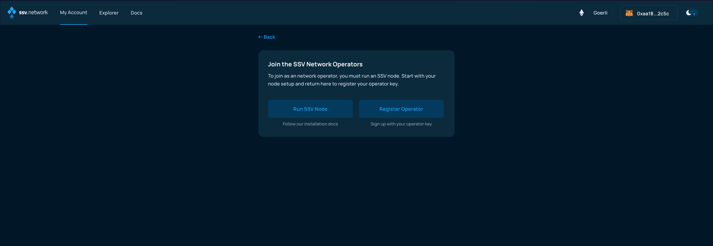
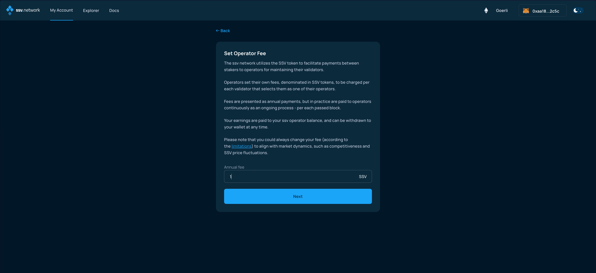
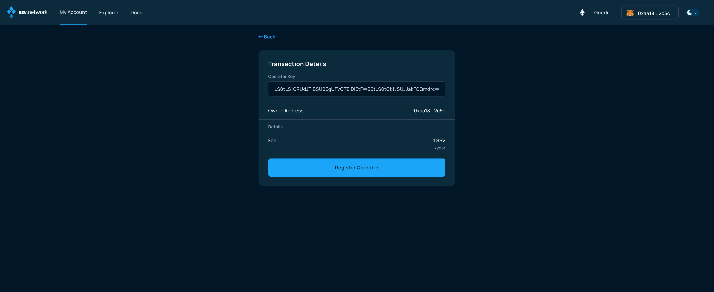
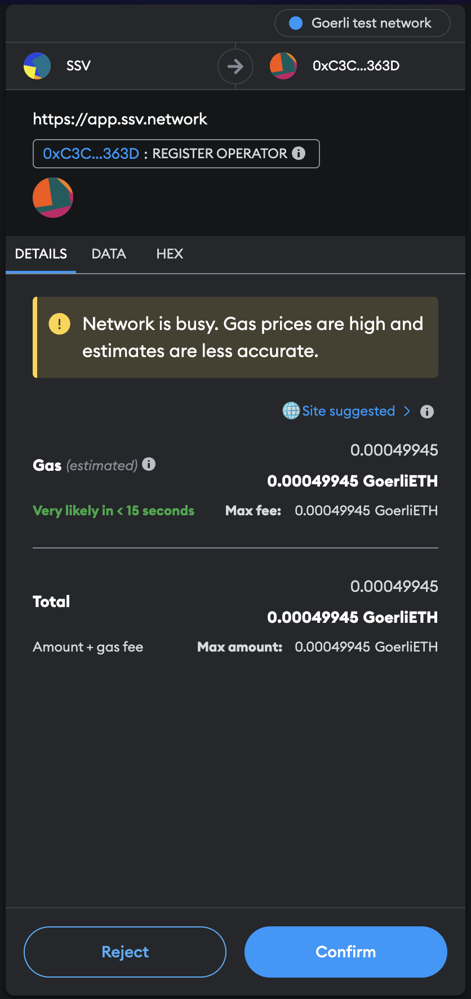
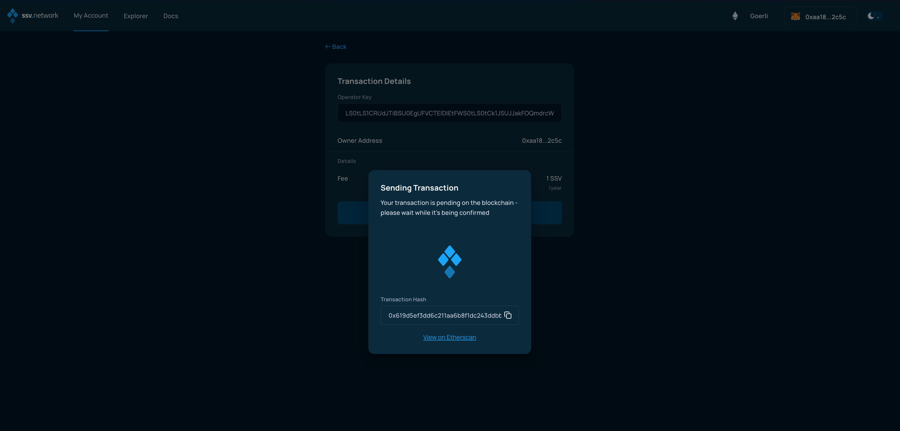
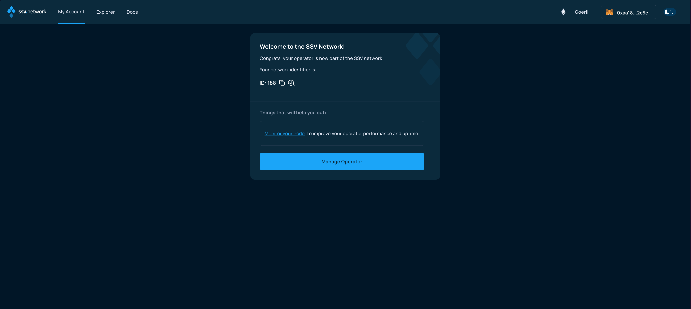

# Registering an Operator


For information on how to set up and run an SSV Node, please [visit the dedicated page](../operator-node/installation/).


After successfully running an SSV node, an operator must register it to the SSV Network in order to be discoverable by validators.

You can register your operator through the SSV network [web app](https://app.ssv.network) or via a transaction directly to the [smart contract](../../developers/smart-contracts/ssvnetwork.md#public-registeroperator-publickey-operatorfee)&#x20;

While registering your operator you will need to provide the following parameters:

* [Operator public key](../operator-node/installation/#4.-generate-operator-keys) - Generated in the node installation process (base64 format)
* [Operator fee](../../learn/operators/#operator-fee) - The fee charged by the operator per each managed validator


The wallet address used to register the operator is the only address that will hold management permissions for it.


## Registering an Operator on the WebApp

Make sure to connect your Web3 wallet with the WebApp, and that the address corresponds with the one you want to manage your Operators with.


**Note:** Your account is associated with your Web3 wallet.


If you are connecting for the first time, you should see a screen like the image below:

<figure><figcaption></figcaption></figure>

Please select _Join as Operator._

In the following screen, select _Register Operator_ (just make sure [that you followed the guide on Node setup](../operator-node/installation/) and that your SSV Node is running).

<figure><figcaption></figcaption></figure>

The next screen will ask you to input the Operator's public key (refer to [the Node setup guide](../operator-node/installation/#key-pair-generation-and-encryption) for key generation) and provide a confirmation of the Operator owner address.

Here you will also have to choose whether your Operator status is either [public or private](../../learn/operators/permissioned-operators.md).


Please verify once more that the owner address correspond to the wallet address you want to manage your operators with.


Click _Next_ when ready.

<figure><figcaption></figcaption></figure>

In the following screen, shown below, you are being asked to set the Operator Fee.

For more information about fees, please [head over to the related page](../../learn/protocol-overview/tokenomics/fees.md#_ht1v5x3rp8hp). Just know that it will be possible to update the Operator fees later, [with limitations imposed by the protocol, to protect stakers](../../learn/operators/update-fee.md), for a guide on how to do that, head over to [the dedicated page](updating-operator-fees.md).

Enter a number and click _Next_ when ready.

<figure><figcaption></figcaption></figure>

This confirmation screen presents a recap of the information input so far. Double check everything and click _Register Operator_ when ready.

<figure><figcaption></figcaption></figure>

The WebApp will generate a blockchain transaction, make sure to open your Web3 wallet, if it does not automatically and confirm the transaction.

<figure><figcaption></figcaption></figure>

The WebApp will update, waiting for the transaction to be confirmed by the network.

<figure><figcaption></figcaption></figure>

Congratulations, your Operator is successfully registered, and stakers could now choose it to operate their validators.

<figure><figcaption></figcaption></figure>
