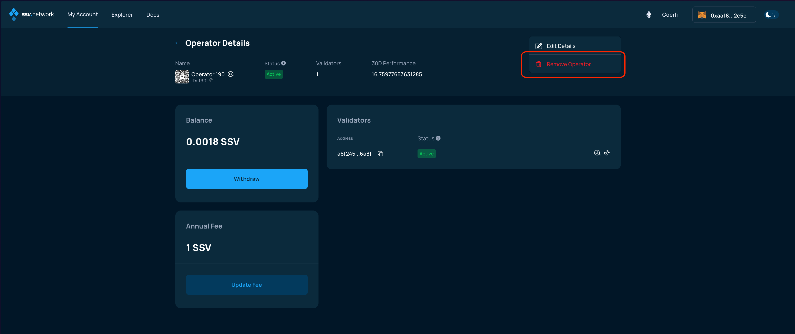
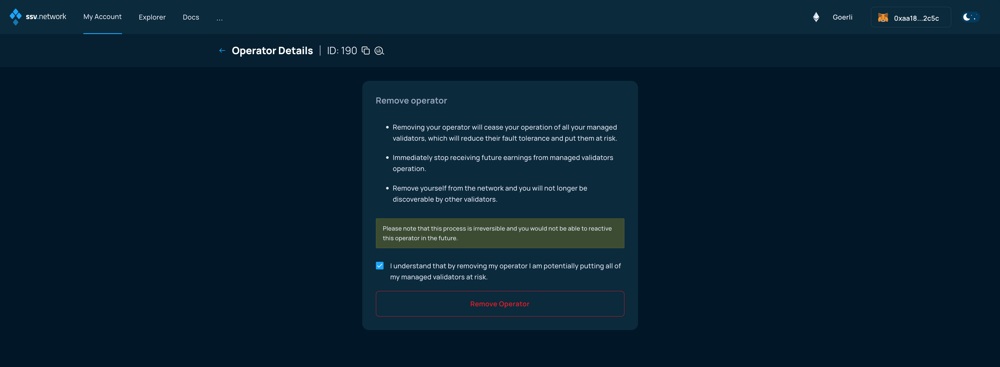
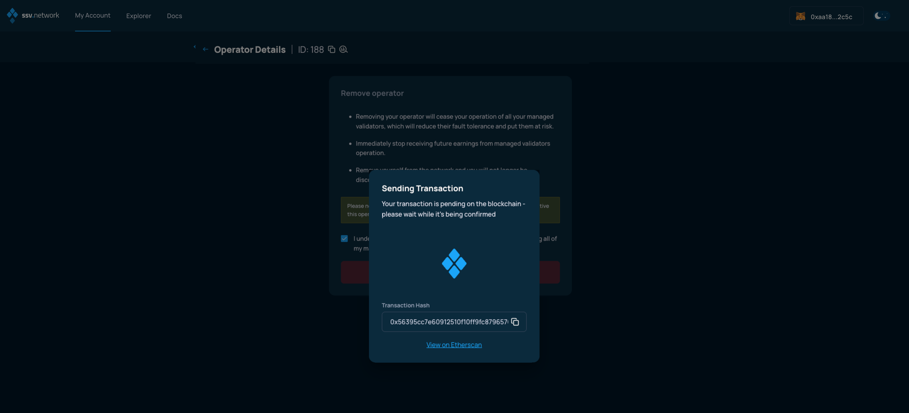

# Removing an Operator


Please be aware: this process is irreversible and removed Operators would not be able to reactivate or register this operator back in the future.

Attempting to register an Operator using the same private key will result in an error. In such a case, Operator registration must be done with with a new key.


### Connect your Web3 wallet to WebApp.

Make sure to connect your Web3 wallet with the WebApp, and that the address corresponds with the one you want to manage your Operators with.


**Note:** Your account is associated with your Web3 wallet.


Once connected, browse to the _My Account_ page and select the Operator you want to update from the _Operator Dashboard_.

<figure><figcaption></figcaption></figure>

Then, on the _Operator Details_ screen, click on the three vertical dots on the top-right corner. From the dropdown, choose the _Remove Operator_ option.

<figure><figcaption></figcaption></figure>

The next screen provides information about the consequences of this action and asks you for a confirmation by ticking a checkbox. To confirm, click on the _Remove Operator_ button.

<figure><figcaption></figcaption></figure>

A smart contract transaction is generated by the WebApp, make sure to open your Web3 wallet, if it does not automatically and confirm the transaction.

<figure><figcaption></figcaption></figure>

The WebApp will update, waiting for the transaction to be confirmed by the network.

<figure><figcaption></figcaption></figure>

When the transaction is confirmed by the network, the Operator will have been successfully removed from the ssv.network.
