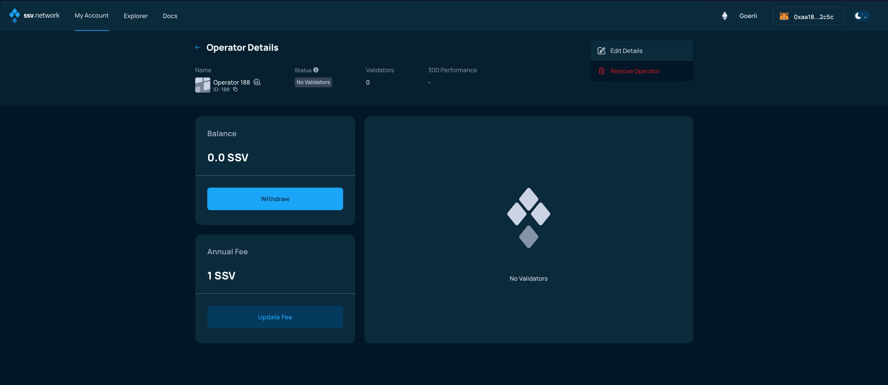
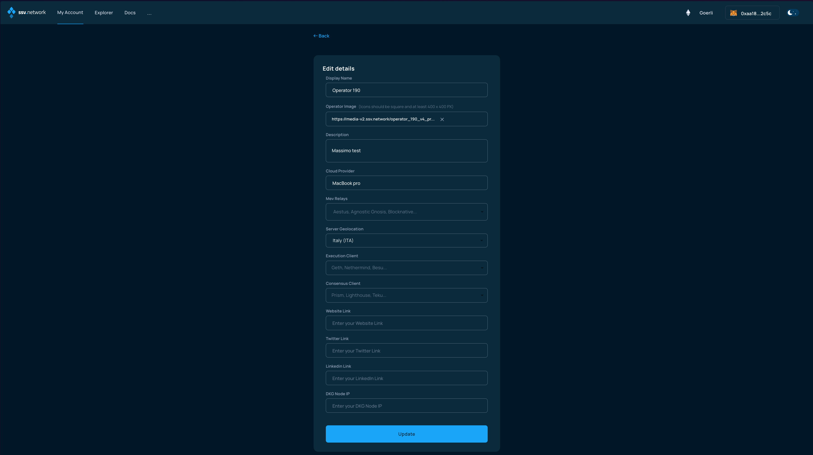

# Setting Operator metadata

### Connect your Web3 wallet to WebApp.

Make sure to connect your Web3 wallet with the WebApp, and that the address corresponds with the one you want to manage your Operators with.


**Note:** Your account is associated with your Web3 wallet.


Once connected, use browse to the _My Account_ page and click on the _Validators_ drop down menu, and select _Operators_.

<figure><figcaption></figcaption></figure>

In the Operator Details screen, click on the three vertical dots on the top-right corner.

<figure><figcaption></figcaption></figure>

From the dropdown, choose the _Edit Details_ option.

<figure><figcaption></figcaption></figure>

In the following screen, fill-in the form with the information you want to edit.

Remember: the more details you can provide the better, as it will help stakers making informed decision when selecting operators to manage their validator clusters.

<figure><figcaption></figcaption></figure>

When you are done, click the _Update_ button, the WebApp will ask you to provide a signature of a message.

Make sure to open your Web3 wallet, if it does not automatically and confirm the transaction.

<figure><figcaption></figcaption></figure>


This is not a transaction and will not cost any gas, it's only needed to verify that you are the Operator owner.


When the message is successfully signed, the Operator metadata will have been correctly updated.
