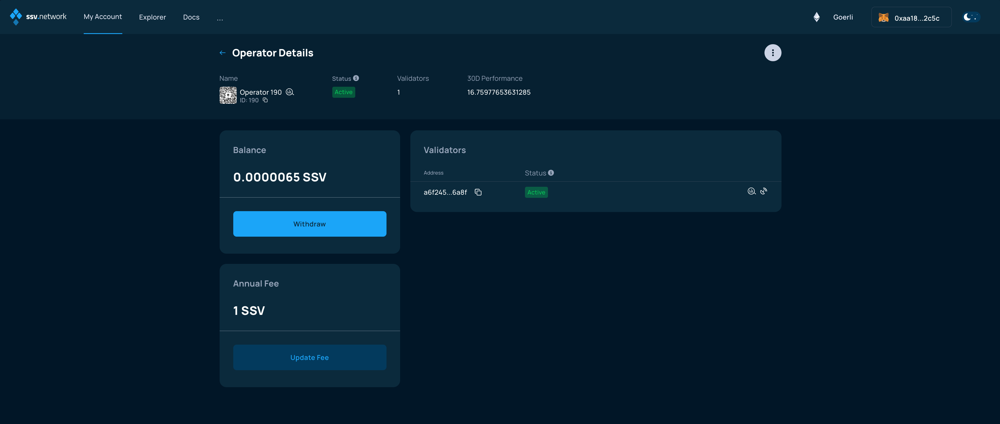
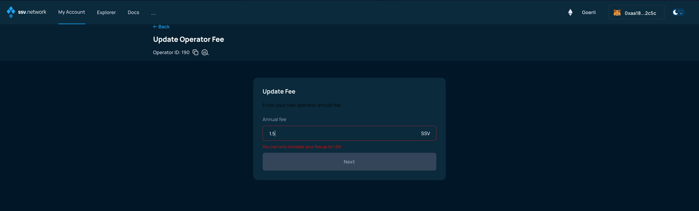
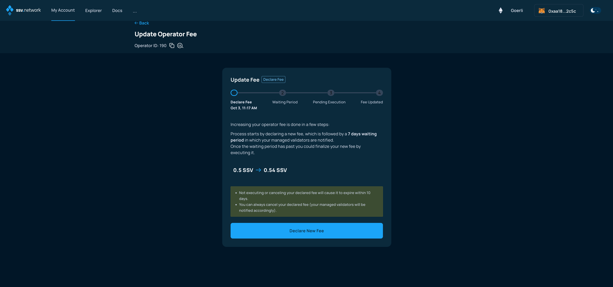
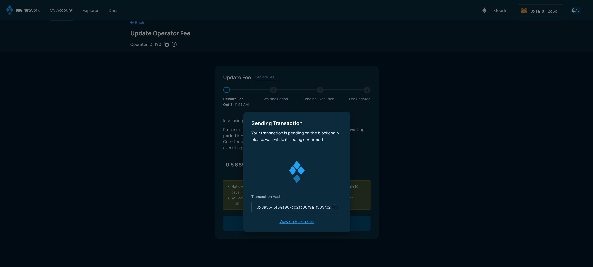
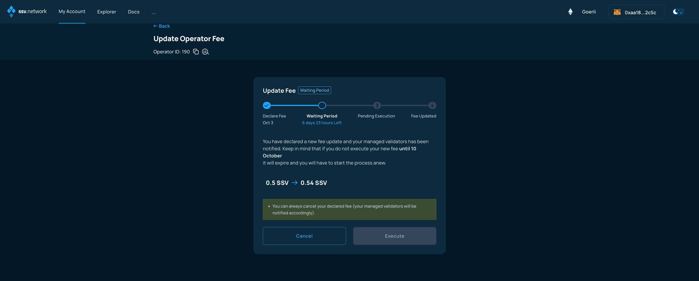
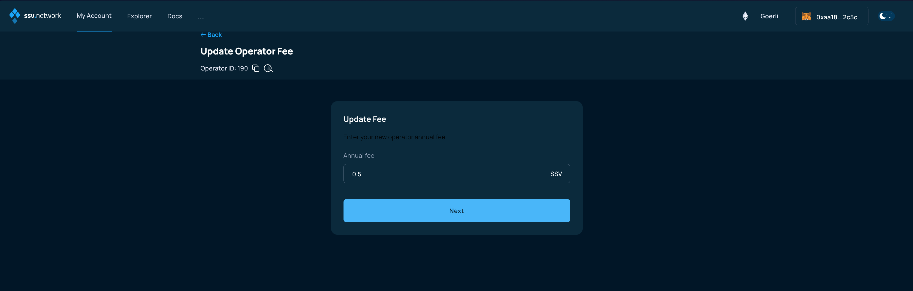
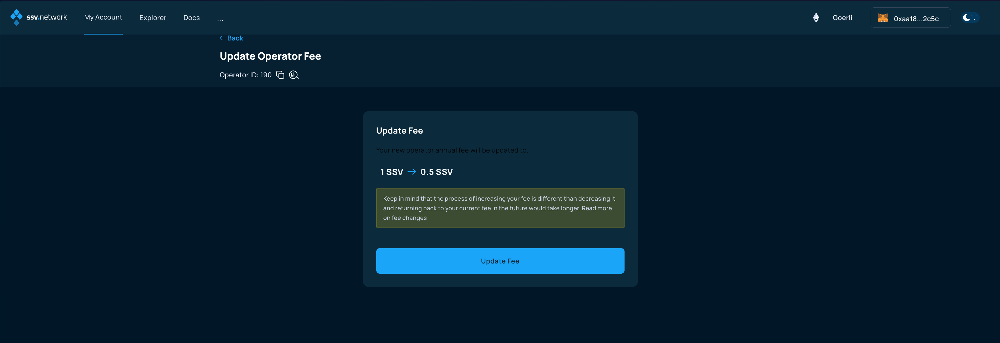
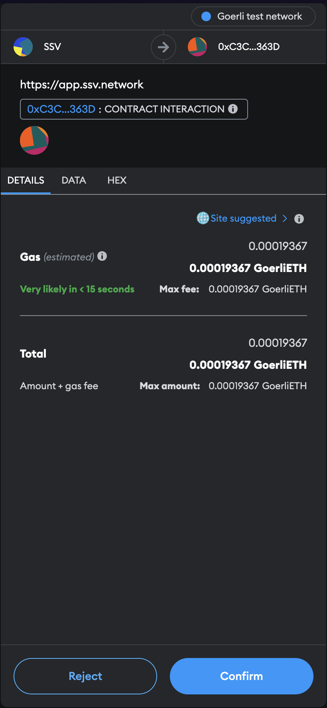
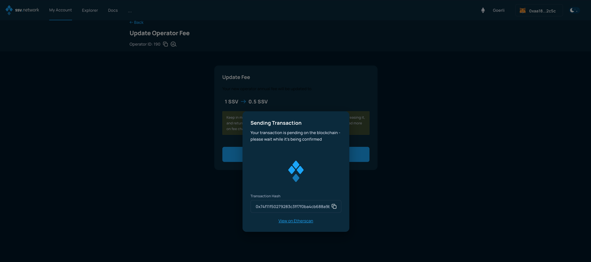

# Updating Operator fees

### Connect your Web3 wallet to WebApp

Make sure to connect your Web3 wallet with the WebApp, and that the address corresponds with the one you want to manage your Operators with.


**Note:** Your account is associated with your Web3 wallet.


Once connected, browse to the _My Account_ page and select the Operator you want to update from the _Operator Dashboard_.

<figure><figcaption></figcaption></figure>

Then, on the _Operator Details_ screen, click on the _Update Fee_ button at the bottom left.

<figure><figcaption></figcaption></figure>

### Increasing Operator fee

In the following screen you'll be asked to enter a new fee. Just pay attention: there are limits imposed by the protocol for incrementing the Operator fee, please read more about this in [the dedicated section](../../learn/operators/update-fee.md).

<figure><figcaption></figcaption></figure>

If the proposed updated fee is within the limits, you can select _Next_, and the following screen is going to explain that the procedure is divided in two steps:

* fee update declaration
* fee update execution

The current operation is about declaring the new fee.

<figure><figcaption></figcaption></figure>

You'll have to submit and confirm a transaction to interact with the smart contract, in order for the fee updates to be declared.

<figure><figcaption></figcaption></figure>

<figure><figcaption></figcaption></figure>

Then, a waiting period is necessary to let all the validators using this operators know about the fee update.

You can cancel the fee update at any time, but you will have to wait until the end of the waiting period to _Execute._

So, after the period has ended you will have to come back to this page and confirm the _Execution_ of the fee update.

<figure><figcaption></figcaption></figure>

### Decreasing Operator fee

On the other hand, there are no limitations for decreasing the Operator fee, as it is advantagious for Stakers.

Once you have decided a new fee which complies with the protocol's limits, click _Next_.

<figure><figcaption></figcaption></figure>

The following screen summarizes the changes to be applied, asking for confirmation.

<figure><figcaption></figcaption></figure>

When clicking on _Update Fee_ button, a smart contract transaction is generated by the WebApp, make sure to open your Web3 wallet, if it does not automatically and confirm the transaction.

<figure><figcaption></figcaption></figure>

The WebApp will update, waiting for the transaction to be confirmed by the network.

<figure><figcaption></figcaption></figure>

When the transaction is confirmed by the network, the changes will take place. Bear in mind, once again, that in case of Fee increase, there will be a delay, to make sure Validators are aware and can decide accordingly.
