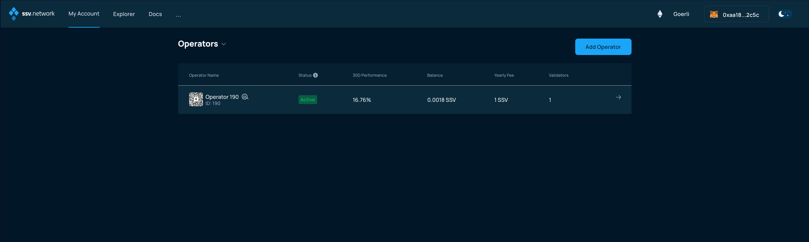
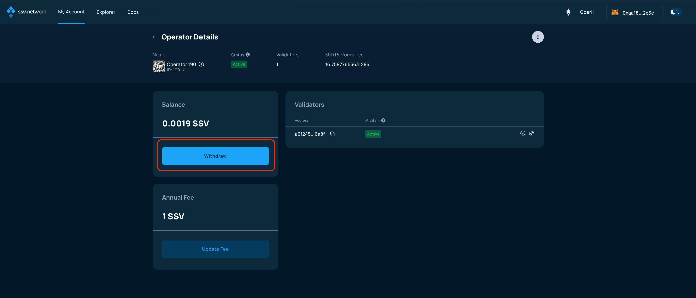
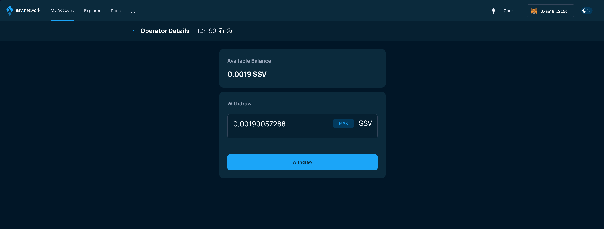
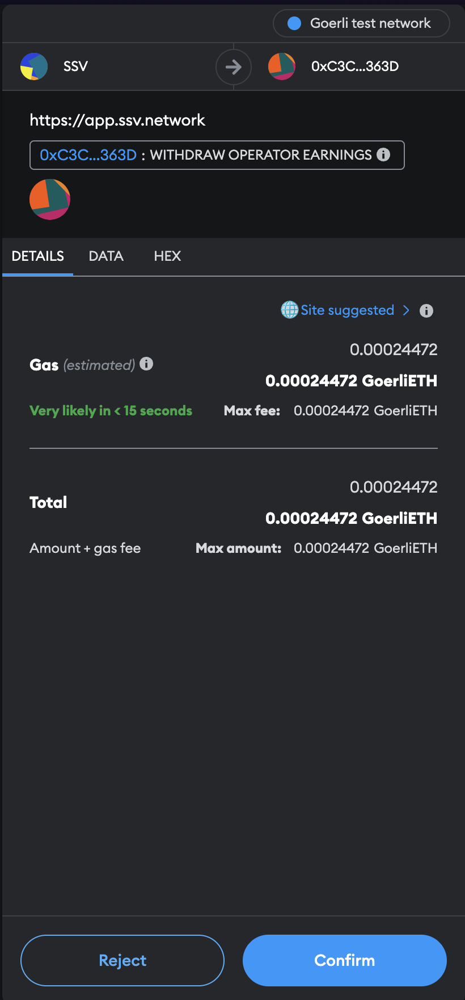

# Withdrawing earnings

### Connect your Web3 wallet to WebApp.

Make sure to connect your Web3 wallet with the WebApp, and that the address corresponds with the one you want to manage your Operators with.


**Note:** Your account is associated with your Web3 wallet.


Once connected, browse to the _My Account_ page and click on the _Validators_ drop down menu, and select _Operators_.

<figure><figcaption></figcaption></figure>

Choose the Operator and then click on the _Withdraw_ button at the bottom left of the screen

<figure><figcaption></figcaption></figure>

In the following screen you'll be asked to enter the amount you intend to withdraw and click on the _Withdraw_ button.

<figure><figcaption></figcaption></figure>

A smart contract transaction is generated by the WebApp, make sure to open your Web3 wallet, if it does not automatically and confirm the transaction.

<figure><figcaption></figcaption></figure>

The WebApp will update, waiting for the transaction to be confirmed by the network, when this happens, the funds will have been transferred to the Operator owner wallet.
