# Adding validator to existing cluster

### Connect your Web3 wallet to the WebApp

Make sure to connect your Web3 wallet with the WebApp, and that the address corresponds with the one you want to manage your Validators with.


**Note:** Your account is associated with your Web3 wallet.


In the My Account page, select an active cluster and then click on the "+ Add Validator" button.

<figure>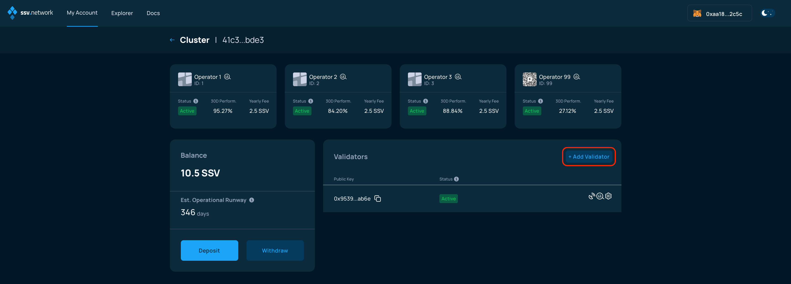<figcaption></figcaption></figure>

You'll be asked how do you want to handle operational costs, in regards to your existing cluster balance.

<figure>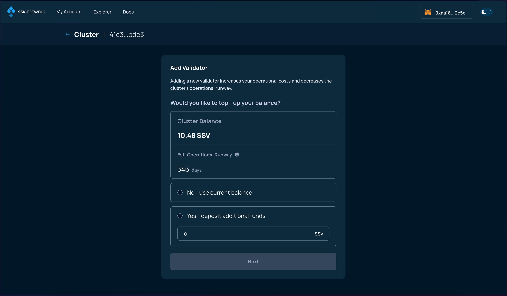<figcaption></figcaption></figure>

### Key splitting

The next screen will allow you to generate KeyShares for your validator key. On testnet, this can be done Online, directly on the WebApp, or Offline, on your computer.

On mainnet, only the Offline option is available.

<figure>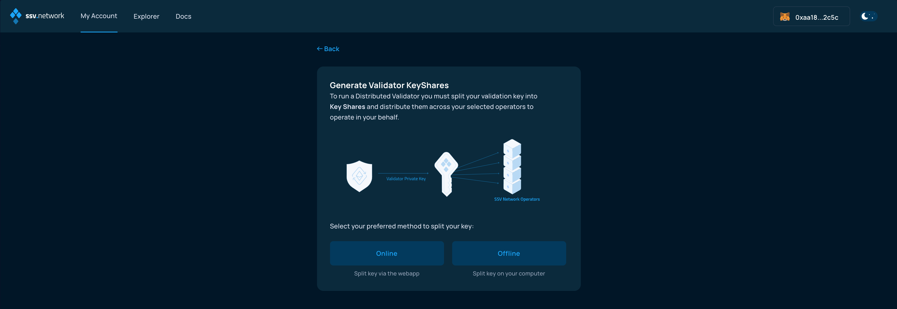<figcaption></figcaption></figure>

#### Online Key Splitting

Online key splitting presents a convenient option, especially for those not familiar with the console,  or command line clients.

This is not considered safe and is only available on testnet for testing purposes.


Please never perform a Online key splitting on testnet, with a private key that you intend to use on mainnet.


<figure>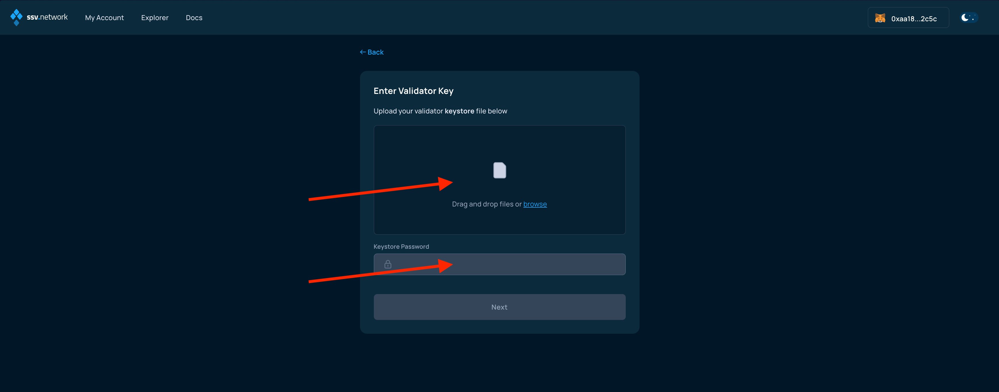<figcaption></figcaption></figure>

If the Online option is choosen, the next screen allows you to upload the Validator key (file named keystore) and enter the password to decrypt it.

<figure>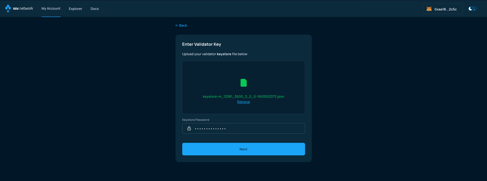<figcaption></figcaption></figure>

#### Offline Key Splitting

Offline key splitting is the most secure option, although less convenient, as it requires running a command line tool. For more information, refer to the specific [User Guide on how to use the ssv-keys CLI tool](../tools/ssv-keys-cli.md).

<figure><figcaption></figcaption></figure>

If the Offline option was selected, please follow the indications (image above) and upload the generated `keyshares-[DATE]-[TIME].json` file in the following screen.

<figure>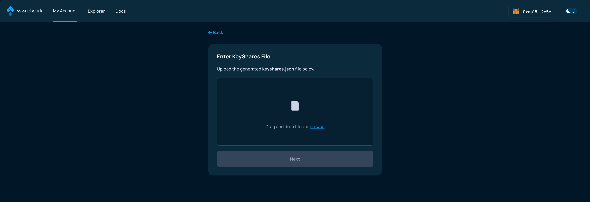<figcaption></figcaption></figure>

Once uploaded, if successfully validated, advance to the next screen clicking Next.

<figure>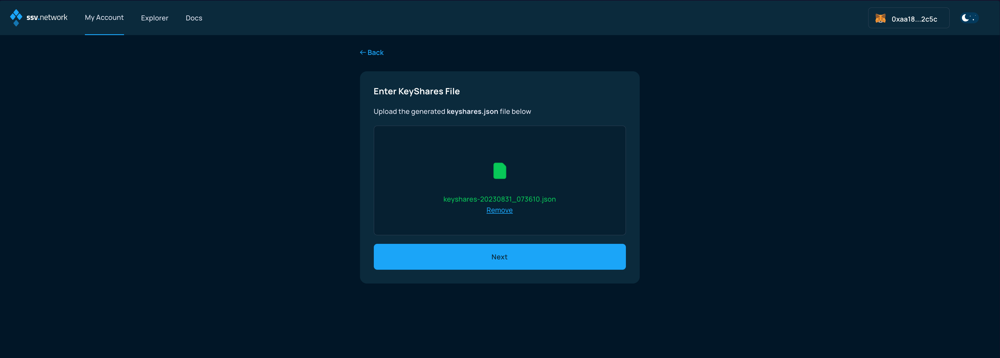<figcaption></figcaption></figure>

### Slashing warning

The following screen alerts you of the potential dangers of registering a validator on the SSV network, if the same set of validator keys is also being used by other consensus and validator clients.

Please make sure to stop any other running validator setup, if you have any.

<figure>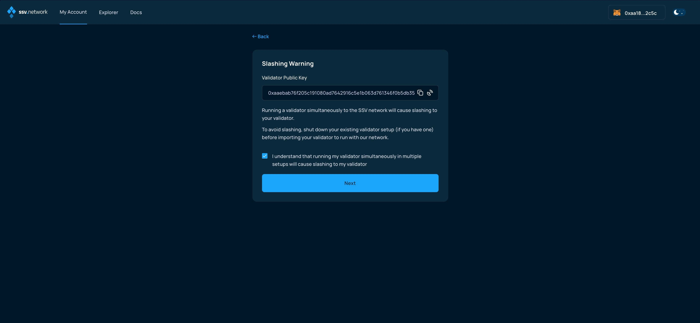<figcaption></figcaption></figure>

### Validator summary

The next screen presents a summary of your validator setup.

<figure>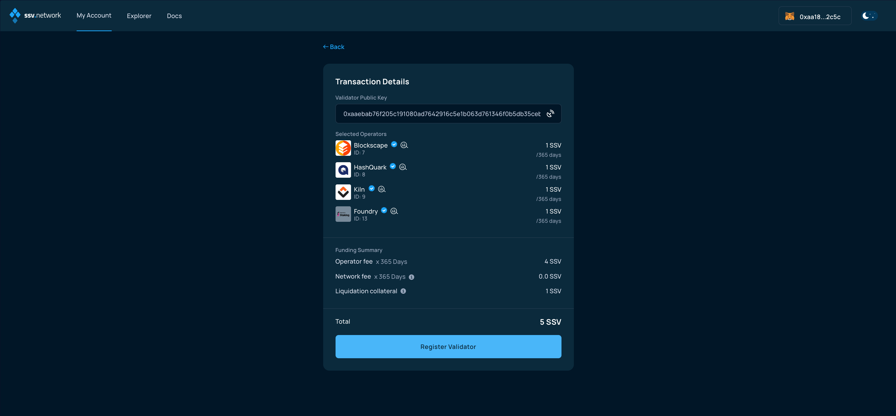<figcaption></figcaption></figure>

By clicking on Register validator, you'll be proposed to sign transactions to confirm your choice and transfer the SSV balance necessary to cover for the operational costs.


**Note:** If this is the first time you are registering a validator to ssv.network, you will be required to make two transactions - one to approve the SSV smart contract and another one to register the validator.


<figure>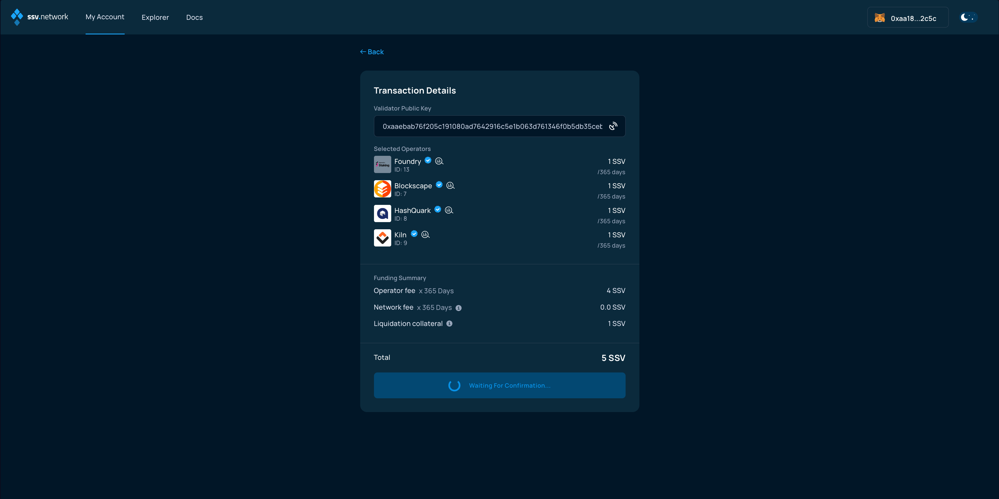<figcaption></figcaption></figure>

### SSV Balance deposit

Now, finalize the validator registration by signing the transaction and adding SSV tokens to your account balance.

<figure><figcaption></figcaption></figure>

You will need to confirm the transaction in your web3 wallet.

<figure>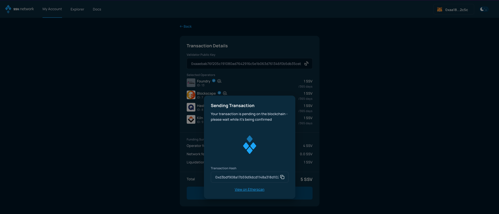<figcaption></figcaption></figure>

Once the transaction has been signed and confirmed by the network, you'll be presented with the summary screen.

<figure>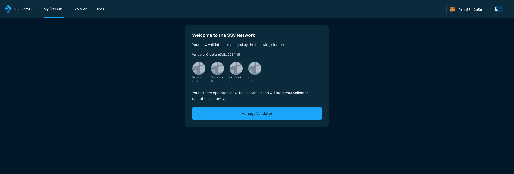<figcaption></figcaption></figure>

**Congratulations! You’re all set!🥳**
