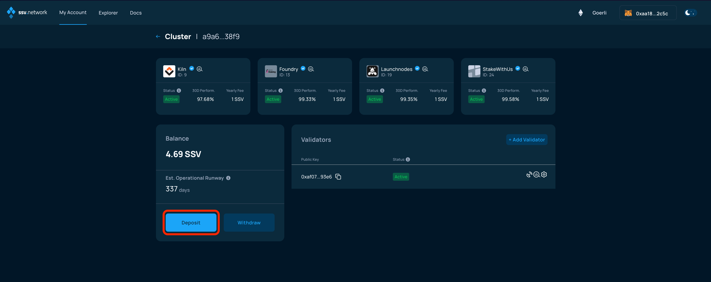
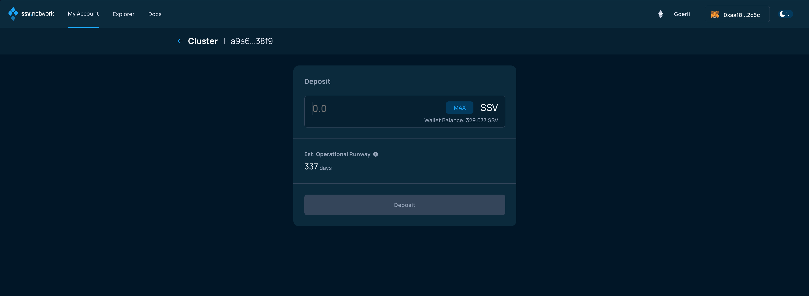
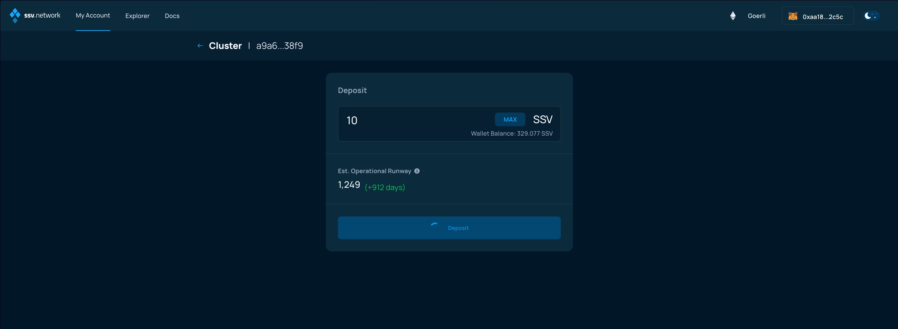

# Depositing SSV

### Connect your Web3 wallet to the WebApp

The SSV token is used as as the payment layer of the network and the cluster balance is necessary to reward its operators.

For more information on this topic, please refer to [the dedicated learning page](../../learn/stakers/clusters/cluster-balance.md).

Make sure to connect your Web3 wallet with the WebApp, and that the address corresponds with the one you want to manage your Validators with.


**Note:** Your account is associated with your Web3 wallet.


In the My Account page, select an active cluster and then click on the "Deposit" button.

<figure><figcaption></figcaption></figure>

In the next screen, you'll be asked to enter the amount of SSV you want to deposit

<figure><figcaption></figcaption></figure>

Once you enter the amount, click on the _Deposit_ button

<figure><figcaption></figcaption></figure>

The page will attempt to submit a transaction to the SSV Network smart contract, check your Web3 wallet.

<figure><figcaption></figcaption></figure>

Now, finalize the deposit on the Cluster by signing the transaction.

<figure><figcaption></figcaption></figure>

You'll be taken back to the Cluster page, where the balance will be updated with the amount of SSV tokens deposited.

<figure><figcaption></figcaption></figure>
