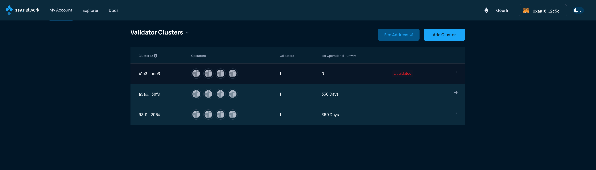
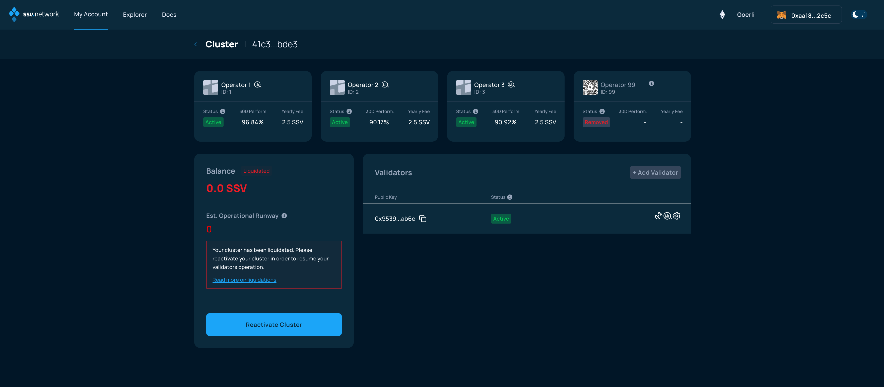
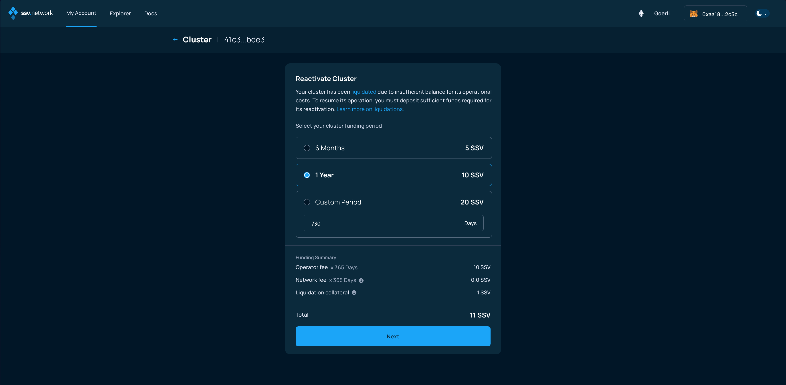
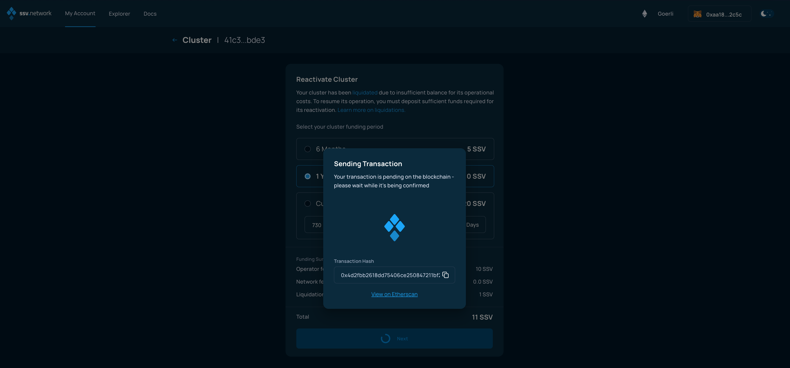
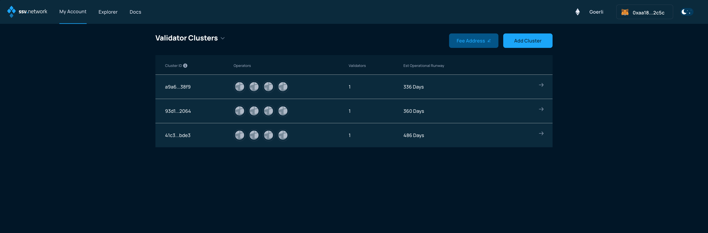

# Re-activating a cluster

### Connect your Web3 wallet to the WebApp

Make sure to connect your Web3 wallet with the WebApp, and that the address corresponds with the one you want to manage your Validators with.


**Note:** Your account is associated with your Web3 wallet.


In the My Account page, select a _Liquidated cluster_ that needs to be reactivated.

<figure><figcaption></figcaption></figure>

In the Cluster page, click on the **Reactivate Cluster** button

<figure><figcaption></figcaption></figure>

In the next screen, you'll be asked to choose the cluster runway, which will impact the  amount of SSV you will have to deposit to reactivate the cluster.

<figure><figcaption></figcaption></figure>

Once you select the runway, click on the _Next_ button. The page will attempt to submit a transaction to the SSV Network smart contract, check your Web3 wallet.

<figure><figcaption></figcaption></figure>

Now, finalize the validator reactivation by signing the transaction.

<figure><figcaption></figcaption></figure>

You'll be taken back to the Cluster page, where the balance will be updated with the amount of SSV tokens deposited.

<figure><figcaption></figcaption></figure>
