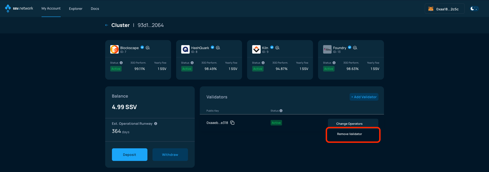
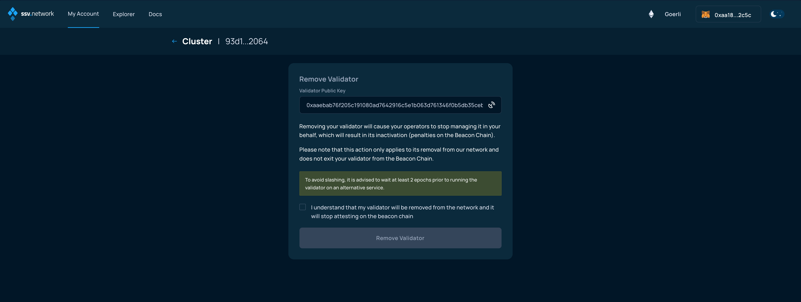
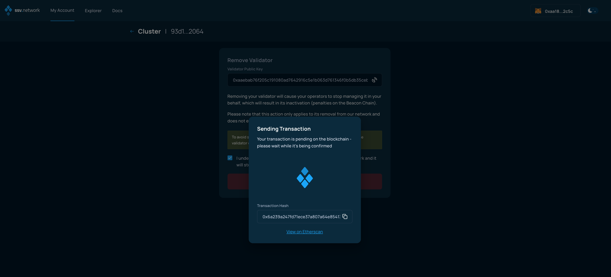

# Removing a validator

### Connect your Web3 wallet to the WebApp

Make sure to connect your Web3 wallet with the WebApp, and that the address corresponds with the one you want to manage your Validators with.


**Note:** Your account is associated with your Web3 wallet.


In the My Account page, select an active cluster:

<figure><figcaption></figcaption></figure>

In the Cluster page, **tap the gear icon** next to the validator you want to remove and select "Remove Validator".

<figure><figcaption></figcaption></figure>

### Inactivity penalties warning

The following screen alerts you of the implications of removing the validator from the cluster.


This will cause the validator to go offline. It is advised to have an alternative validator setup ready to continue operating outside ssv.network, [as explained here](../../learn/stakers/validators/validator-offboarding.md).

Removing the validator is **NOT** reversible, the validator will have to be registered anew on the ssv.network, should you intend to join again.

Please read the text carefully and understand the implications of removing your validator from the network.


When you are ready, check the box and click the Remove Validator button.

<figure><figcaption></figcaption></figure>

### Sign the confirmation

Now, finalize the validator removal by signing the transaction.

<figure><figcaption></figcaption></figure>

You will need to confirm the transaction in your web3 wallet.

<figure><figcaption></figcaption></figure>

Once the transaction has been signed and confirmed by the network, your validator will have been successfully removed from the cluster and no longer handled by operators on the SSV network.\
