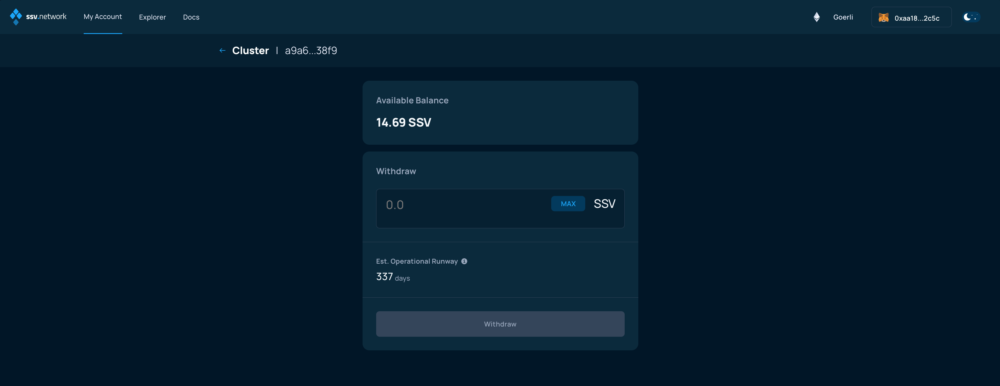
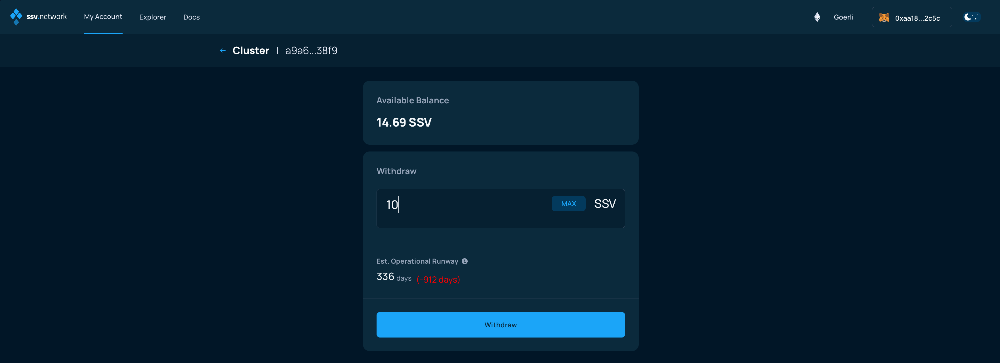
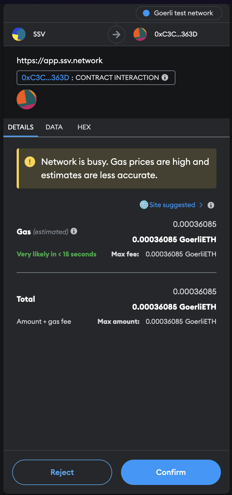
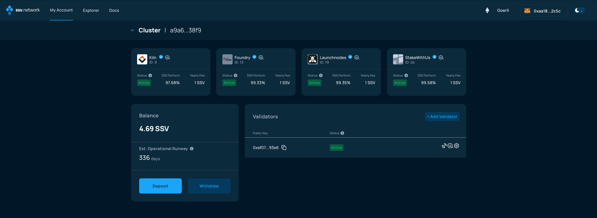

# Withdrawing SSV

### Connect your Web3 wallet to the WebApp

Make sure to connect your Web3 wallet with the WebApp, and that the address corresponds with the one you want to manage your Validators with.


**Note:** Your account is associated with your Web3 wallet.


In the My Account page, select an active cluster and then click on the "Withdraw" button.

<figure><figcaption></figcaption></figure>

In the next screen, you'll be asked to enter the amount of SSV you want to withdraw

<figure><figcaption></figcaption></figure>

Once you enter the amount, click on the Withdraw button. Please take a close look at the updated estimated cluster runway.

<figure><figcaption></figcaption></figure>

The page will attempt to submit a transaction to the SSV Network smart contract, check your Web3 wallet.

Now, finalize the withdrawal from the Cluster by signing the transaction.

<figure><figcaption></figcaption></figure>

You'll be taken back to the Cluster page, where the balance will be updated with the amount of SSV tokens withdrawn.

<figure><figcaption></figcaption></figure>
