# Run a Distributed Key Generation ceremony


The SSV-DKG tool is yet to be audited. **Please refrain from using it on mainnet.**


### Overview

The process described below allows users to generate a set of KeyShares by directly communicating with the SSV Operators they have chosen. With this operation, the actual validator key is never created and no one will be able to have the full validator key in its entirety, just its parts, assigned to each chosen Operator.

Please note that it is possible to switch Operators and Exit the validator at a later time, but you will need the cooperation of the Operators in the cluster, and the threashold to reach consensus is needed, for this to be successful.

Please continue only if you accept these constraints.

### Pre-requisites

In order to generate KeyShares with DKG, the only fundamental pre-requisite is to have Docker installed on the computer running the ceremony. In order to do so, please refer to [the official Docker documentation](https://docs.docker.com/engine/install/), and find the option that better fits your computer.

### Connect your Web3 wallet to WebApp

Make sure to connect your Web3 wallet with the WebApp, and that the address corresponds with the one you want to manage your Validators with.


**Note:** Your account is associated with your Web3 wallet.


#### New accounts

When creating a new account, you are presented with the option of _**Distribute Validator**_ or _**Join as an Operator**_.

Select _Distribute a Validator_.

<figure>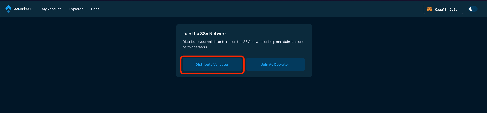<figcaption></figcaption></figure>

#### Existing accounts

In the My Account page, click on Add Cluster to create a new one.

<figure>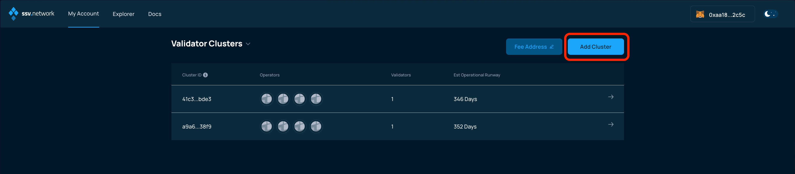<figcaption></figcaption></figure>

Alternatively, you can [onboard additional validators to an existing cluster](broken-reference).


In this case, you will not need to select operators, so you can skip the next step.

You'll simply be asked how do you want to handle operational costs, in regards to your balance.


#### Ethereum validator disclaimer

This screen lists the pre-requisites to distribute an existing set of validator keys, but as stated at the top of this guide, the goal of the procedure described in this page is to directly generate a KeyShares file through a Distributed Key Generation ceremony

So for this reason, simply disregard the disclaimer and click _Next_.

<figure>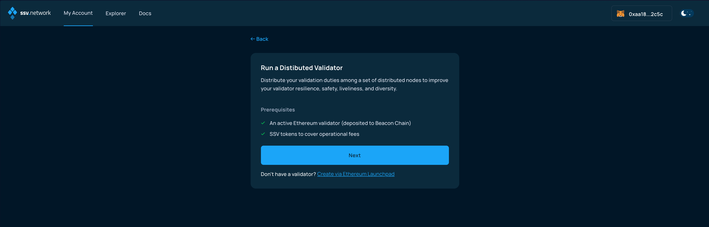<figcaption></figcaption></figure>

### Select operators

Now, select four operators to manage your validator. Please note the **Yearly Fee** for the setup you created before hitting the Next button.

Please make sure to use the _Filter_ button to select Operators that have enabled their node to run DKG ceremonies, like in the screenshot below:

<figure>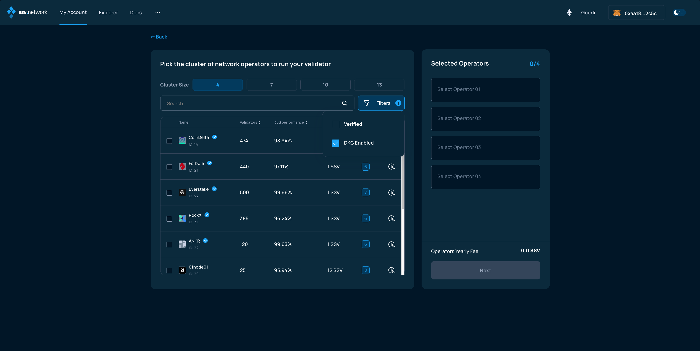<figcaption></figcaption></figure>


**Important:** Verified Operators (VOs) are operators that have been granted the **Verified** status by the DAO for completing KYC and providing consistent high-quality service. You can sort the operator list by their daily performance, yearly fee, and # of validators they manage. You can also filter to view only Verified Operators.


### Validator operational runway

You can select the operational runway period of your validator, in accordance with the **Yearly Fee** of previously selected operators. This will dictate the initial amount of SSV to be deposited in the cluster, but it can always be managed later.

<figure>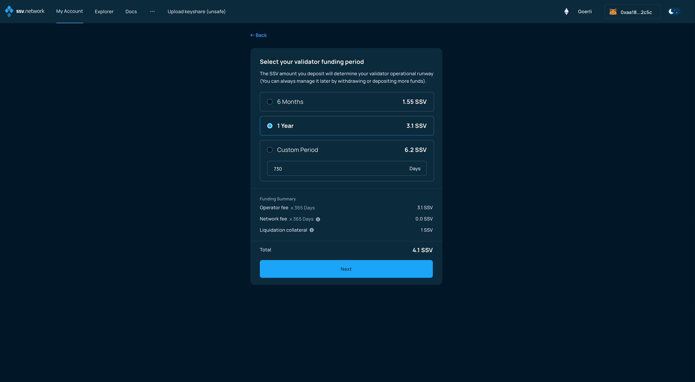<figcaption></figcaption></figure>

**Please read carefully and understand how fees are managed and the risks of account** [**liquidation**](https://ssv.network/glossary/#liquidation) **if your account balance falls below the** [**Threshold Balance**](https://ssv.network/glossary/##threshold-balance)**.**

<figure>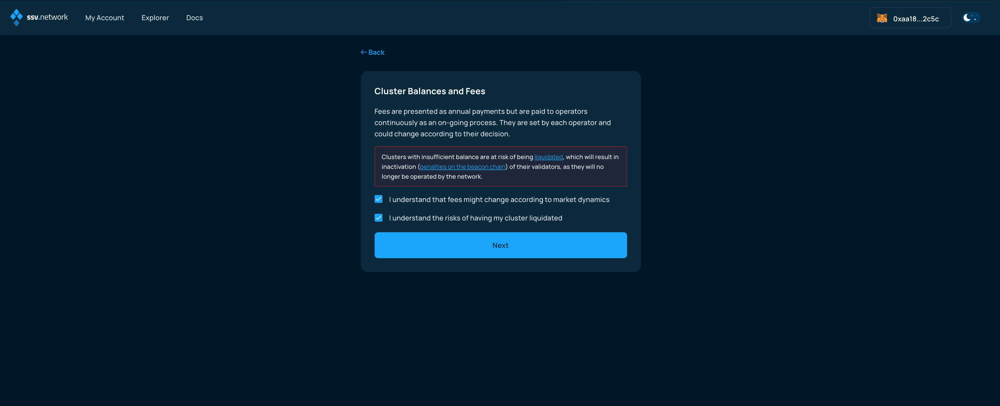<figcaption></figcaption></figure>

### Key splitting

The next screen usually allows you to generate KeyShares for your validator key, but as stated at the top of this guide, the goal of this procedure is to directly generate a KeyShares file through a Distributed Key Generation ceremony.

This can only be done on your personal computer, as you will have to run a command on a terminal, so the only way forward is to choose the _Offline_ option.

<figure>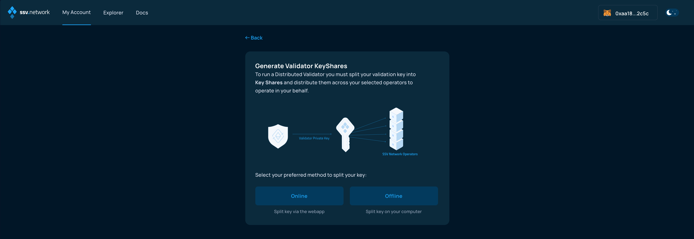<figcaption></figcaption></figure>

From the options presented in the next screen, please select DKG,&#x20;

<figure>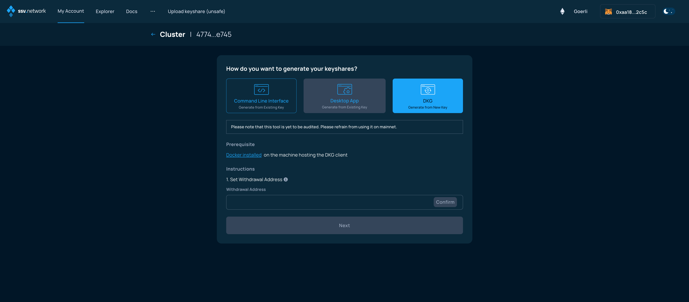<figcaption></figcaption></figure>

Then, enter the withdrawal address for your validator in the _Withdrawal Address_ field, and click _Confirm_ to reveal the command in the area below. Please copy the command and run it on a terminal on your machine.

<figure>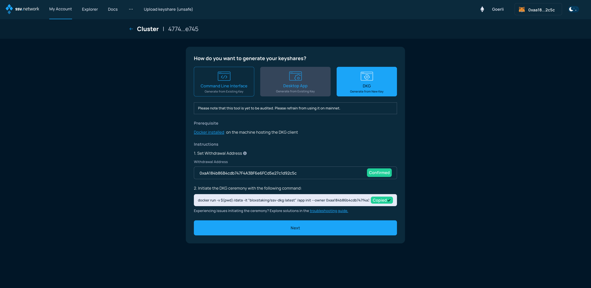<figcaption></figcaption></figure>

After launching the `ssv-dkg` tool as shown above, it will commence a DKG ceremony with the selected operators.

Following the successful completion of the DKG ceremony, several files have been generated and placed in the directory where the command was launched from:

* `deposit-[validator_pubkey].json` -  this file contains the deposit data necessary activate the validator
* `keyshares-[validator_pubkey].json` - this file contains the keyshares necessary to [register the validator on the ssv.network](distributing-a-validator.md)
* `encrypted_private_key-[validator_pubkey].json` and `password-[validator_pubkey]` (not present if the `generateInitiatorKey` option is not used) - these files contain the keys used to sign messages during the ceremony (sometimes called ceremony identifiers), which are **crucial for resharing** your validator to a different set of operators in the future.

Before proceeding, please make sure to perform the transaction on the Deposit Contract for the network you have chosen (e.g. Ethereum mainnet, Goerli, Holesky, ...) and [activate the validator on the Beacon layer by following this guide.](creating-a-new-validator.md#activate-validator-keys)

At this point, click the _Next_ button and upload the generated `keyshares-[validator_pubkey].json` file in the following screen.

<figure>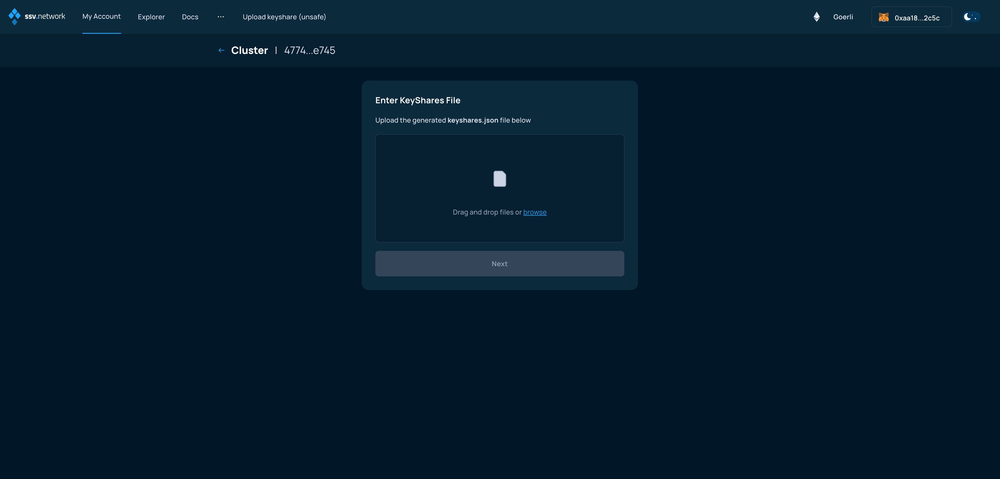<figcaption></figcaption></figure>

Once uploaded, if successfully validated, advance to the next screen clicking Next.

<figure><figcaption></figcaption></figure>

### Slashing warning

The following screen alerts you of the potential dangers of registering a validator on the SSV network, if the same set of validator keys is also being used by other consensus and validator clients.

Please make sure to stop any other running validator setup, if you have any.

<figure>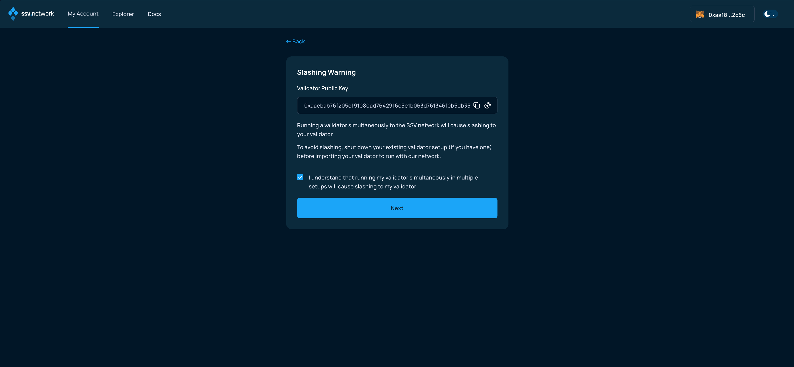<figcaption></figcaption></figure>

### Validator summary

The next screen presents a summary of your validator setup.

<figure>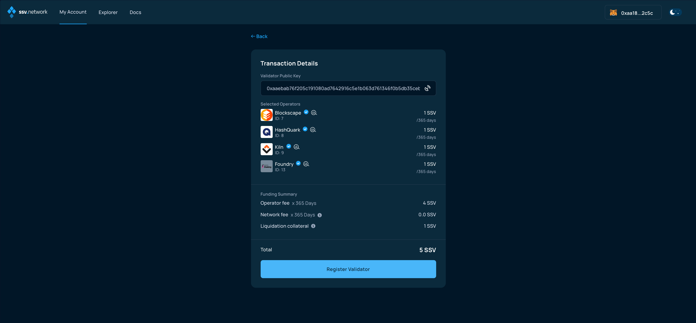<figcaption></figcaption></figure>

By clicking on Register validator, you'll be proposed to sign transactions to confirm your choice and transfer the SSV balance necessary to cover for the operational costs.


**Note:** If this is the first time you are registering a validator to ssv.network, you will be required to make two transactions - one to approve the SSV smart contract and another one to register the validator.


<figure><figcaption></figcaption></figure>

### SSV Balance deposit

Now, finalize the validator registration by signing the transaction and adding SSV tokens to your account balance.

<figure>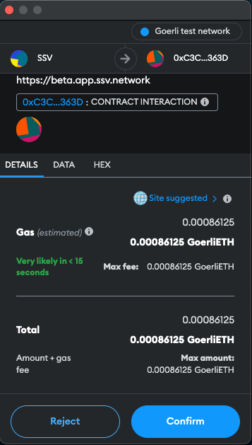<figcaption></figcaption></figure>

You will need to confirm the transaction in your web3 wallet.

<figure>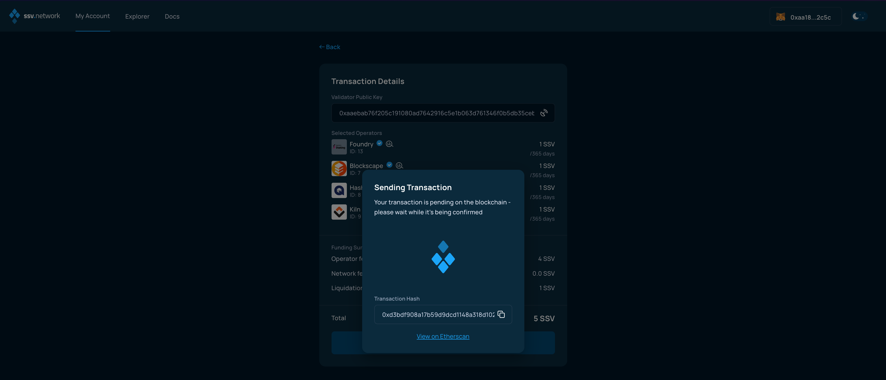<figcaption></figcaption></figure>

Once the transaction has been signed and confirmed by the network, you'll be presented with the summary screen.

<figure>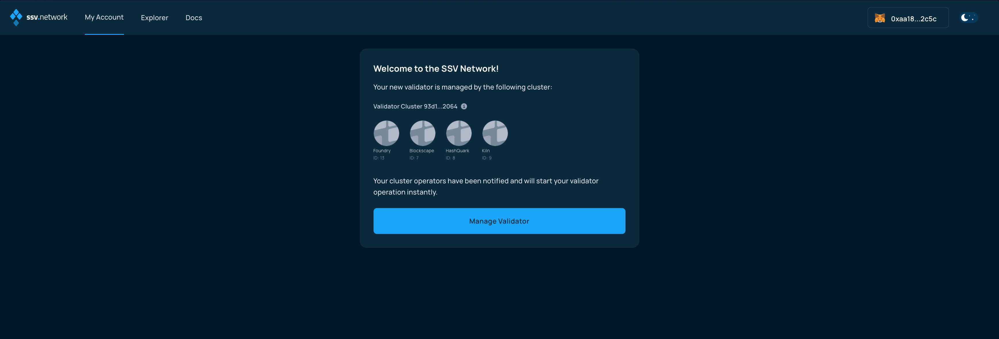<figcaption></figcaption></figure>

**Congratulations! You’re all set!🥳**
