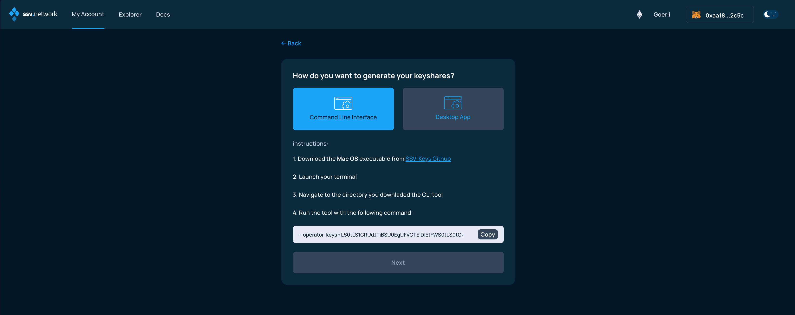
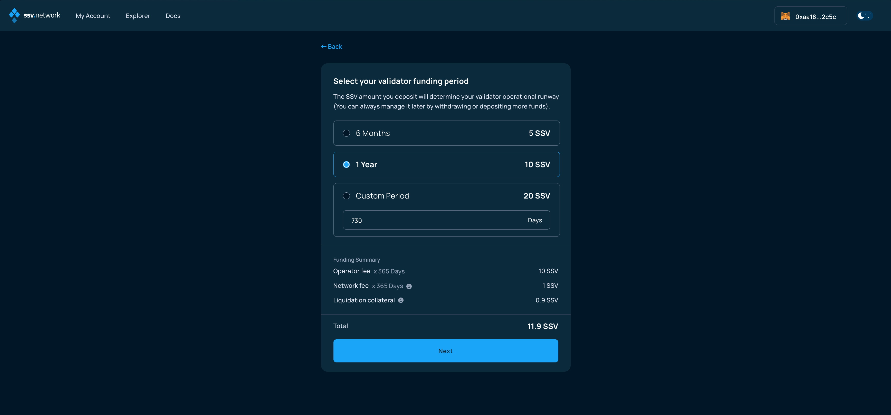

# Distributing a validator

### Connect your Web3 wallet to WebApp

Make sure to connect your Web3 wallet with the WebApp, and that the address corresponds with the one you want to manage your Validators with.


**Note:** Your account is associated with your Web3 wallet.


#### New accounts

When creating a new account, you are presented with the option of _**Distribute Validator**_ or _**Join as an Operator**_.

Select _Distribute a Validator_.

<figure><figcaption></figcaption></figure>

#### Existing accounts

In the My Account page, click on Add Cluster to create a new one.

<figure><figcaption></figcaption></figure>

Alternatively, you can [onboard additional validators to an existing cluster](../cluster-management/adding-validator-to-existing-cluster.md).


In this case, you will not need to select operators, so you can skip the next step.

You'll simply be asked how do you want to handle operational costs, in regards to your balance.


#### Ethereum validator disclaimer

In order to run a validator, you'll need to be in possession of its keys, have made the deposit to the Deposit Contract to activate it, and own the necessary amount of SSV tokens to cover operational costs.


To learn how to create a new set of validator keys and activate them, [please refer to this guide](creating-a-new-validator.md).


Accept the disclaimer by clicking Next if you have all the pre-requisites.

<figure><figcaption></figcaption></figure>

### Select operators

Now, select four operators to manage your validator. Please note the **Yearly Fee** for the setup you created before hitting the Next button.


**Important:** Verified Operators (VOs) are operators that have been granted the **Verified** status by the DAO for completing KYC and providing consistent high-quality service. You can sort the operator list by their daily performance, yearly fee, and # of validators they manage. You can also filter to view only Verified Operators.


<figure><figcaption></figcaption></figure>

### Key splitting

The next screen will allow you to generate KeyShares for your validator key. On testnet, this can be done Online, directly on the WebApp, or Offline, on your computer.

On mainnet, only the Offline option is available.

<figure><figcaption></figcaption></figure>

#### Online Key Splitting

Online key splitting presents a convenient option, especially for those not familiar with the console,  or command line clients.

This is not considered safe and is only available on testnet for testing purposes.


Please never perform a Online key splitting on testnet, with a private key that you intend to use on mainnet.


<figure><figcaption></figcaption></figure>

If the Online option is chosen, the next screen allows you to upload the Validator key (file named keystore) and enter the password to decrypt it.

<figure><figcaption></figcaption></figure>

#### Offline Key Splitting

Offline key splitting is the most secure option, although less convenient, as it requires running a command line tool. For more information, refer to the specific [User Guide on how to use the ssv-keys CLI tool](../tools/ssv-keys-cli.md).


The latest SSV Smart Contract updates added support for [_bulk operations_](../../developers/smart-contracts/ssvnetwork.md#bulkregistervalidator-publickey-operatorids-shares-amount-cluster), and the latest release of`ssv-keys` has been made compatible with bulk operations. With version 1.1.0 (and above), it is possible to generate keyshares for multiple keystores in a single operation.


<figure><figcaption></figcaption></figure>

If the Offline option was selected, please follow the indications (image above) and upload the generated `keyshares-[DATE]-[TIME].json` file in the following screen.

<figure><figcaption></figcaption></figure>

Once uploaded, if successfully validated, advance to the next screen clicking Next.

<figure><figcaption></figcaption></figure>


The SSV WebApp has been upgraded to include the ability to process `keyshares` files that contain multiple validator KeyShares.

This makes it possible to distribute multiple validators in a single transaction, thanks to the latest updates to the SSV Smart Contract.


### Validator operational runway

You can select the operational runway period of your validator, in accordance with the **Yearly Fee** of previously selected operators. This will dictate the initial amount of SSV to be deposited in the cluster, but it can always be managed later.

<figure><figcaption></figcaption></figure>

**Please read carefully and understand how fees are managed and the risks of account** [**liquidation**](https://ssv.network/glossary/#liquidation) **if your account balance falls below the** [**Threshold Balance**](https://ssv.network/glossary/##threshold-balance)**.**

<figure><figcaption></figcaption></figure>

### Slashing warning

The following screen alerts you of the potential dangers of registering a validator on the SSV network, if the same set of validator keys is also being used by other consensus and validator clients.

Please make sure to stop any other running validator setup, if you have any.

<figure><figcaption></figcaption></figure>

### Validator summary

The next screen presents a summary of your validator setup.

<figure><figcaption></figcaption></figure>

By clicking on Register validator(s), you'll be proposed to sign transactions to confirm your choice and transfer the SSV balance necessary to cover for the operational costs.


**Note:** If this is the first time you are registering a validator to ssv.network, you will be required to make two transactions - one to approve the SSV smart contract and another one to register the validator.


### SSV Balance deposit

Now, finalize the validator registration by signing the transaction and adding SSV tokens to your account balance.

<figure><figcaption></figcaption></figure>

You will need to confirm the transaction in your web3 wallet.

<figure><figcaption></figcaption></figure>

Once the transaction has been signed and confirmed by the network, you'll be presented with the summary screen.

<figure><figcaption></figcaption></figure>

**Congratulations! You’re all set!🥳**
