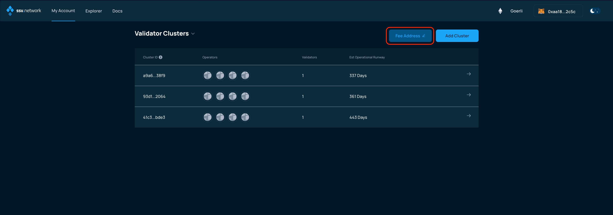
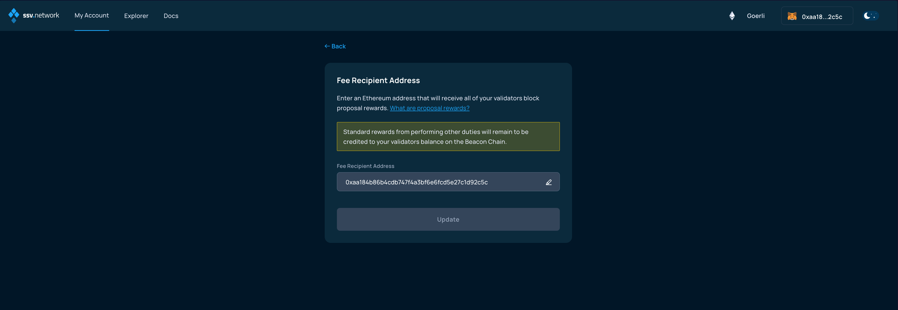
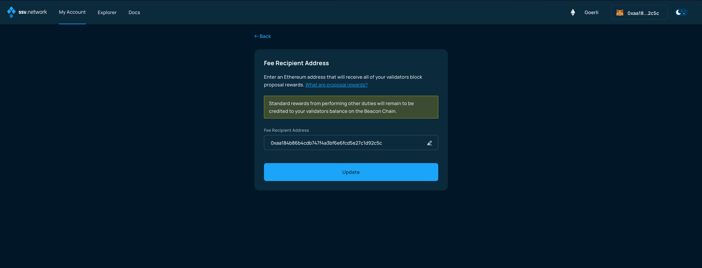
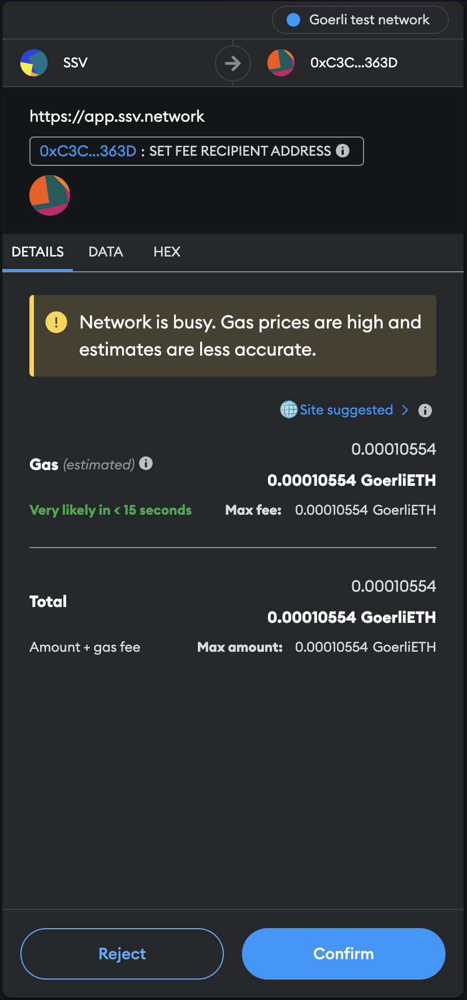

# Setting fee recipient address

### Connect your Web3 wallet to WebApp.

The default setting for all validators in a given account is to send execution layer rewards to the owner address. This page explains how to change this.


This procedure will set the fee recipient address for block proposal rewards **for all your validators**.


For more information on this topic, please refer to [the dedicated learning page](../../learn/stakers/validators/validator-rewards.md).

Make sure to connect your Web3 wallet with the WebApp, and that the address corresponds with the one you want to manage your Validators with.


**Note:** Your account is associated with your Web3 wallet.


In the Validator Clusters dashboard under My Account page, click on the Fee Address button:

<figure><figcaption></figcaption></figure>

In the next screen, click on the pencil icon next to the address:

<figure><figcaption></figcaption></figure>

Enter the address of the wallet you want to receive rewards for all your validators, then click on Update:

<figure><figcaption></figcaption></figure>

Confirm and sign the transaction from your Web3 wallet (Metamask in the example):

<figure><figcaption></figcaption></figure>

Once the transaction has been signed and confirmed by the network, the fee recipient address for block proposal rewards will be correctly set for all your validators.
